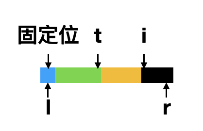
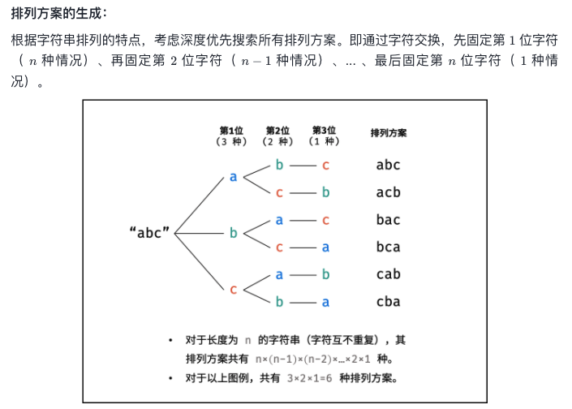
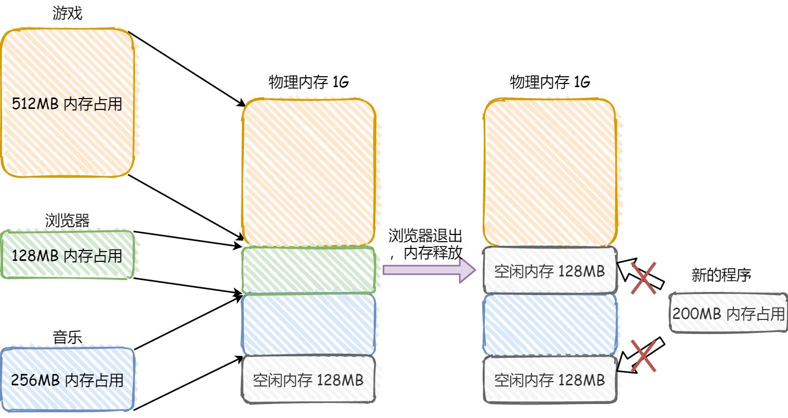
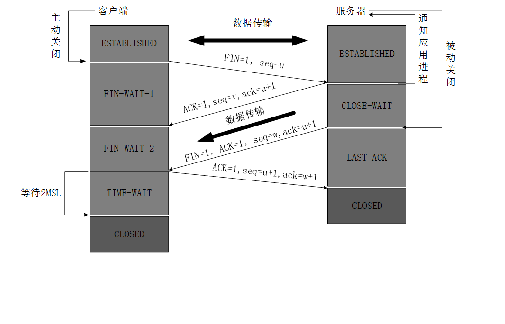

# 题目详解

[toc]

## 排序

### 快排

#### 模版1

核心思想是

比第一位大的, 移到最后

比第一位小的, pass

```c
void my_qsort(vector<int> &nums, int l, int r) {
    if (l >= r)
        return;

    int j = r;
    int i;
    for (i = l + 1; i <= j; ++i) {
        if (nums[i] > nums[l]) {
            // 这里之所以需要i--, 是不知道交换的 j 是不是比 l 大
            // 所以让 i 停在原地
            swap(nums[i--], nums[j--]);
        }
    }
    swap(nums[j], nums[l]);
    my_qsort(nums, l, j - 1);
    my_qsort(nums, j + 1, r);
}
```


#### 模版2



核心思想是

固定第一个

l+1 ~ t 之间都是比固定位小的

t+1 ~ i 之间都是比固定位大的

i 用来遍历所有

注意: 在 t 和 i 没有分开之前, t 和 i 一直在做自身的交换, 不影响

```c
void my_qsort(vector<int> &nums, int l, int r) {
    if (l >= r)
        return;
  
    int t = l;
    int i;
    for (i = l + 1; i <= r; ++i) {
        if (nums[i] < nums[l])
            swap(nums[i], nums[++t]);
    }
    swap(nums[l], nums[t]);
    my_qsort(nums, l, t - 1);
    my_qsort(nums, t + 1, r);
}
```


### 归并排序

#### 模版

递归向下的过程中二分数组, 直到每个元素都是1个

在递归向上的过程中, 两两合并每个元素, 那么每个数组都是有序的

排序两个有序数组到辅助数组中

然后把辅助数组的元素复制到原数组的对应位置即可

```c
void merge(int *nums, int left, int right) {
    if (left >= right)
        return;

    int st1, ed1, st2, ed2;
    st1 = left;
    ed1 = left + (right - left) / 2;
    st2 = ed1 + 1;
    ed2 = right;
    merge(nums, st1, ed1);
    merge(nums, st2, ed2);

    int temp[right - left + 1];
    int t = 0;
    while (st1 <= ed1 && st2 <= ed2)
        temp[t++] = nums[st1] < nums[st2] ? nums[st1++] : nums[st2++];
    while (st1 <= ed1)
        temp[t++] = nums[st1++];
    while (st2 <= ed2)
        temp[t++] = nums[st2++];

    t = 0;
    for (int i = left; i <= right; ++i)
        nums[i] = temp[t++];
}

void merge_sort(int *nums, size_t len) {
    merge(nums, 0, len - 1);
}
```


### 215 数组中的第K个最大元素

>
> 给定整数数组 `nums` 和整数 `k`，请返回数组中第 `**k**` 个最大的元素。
>
> 请注意，你需要找的是数组排序后的第 `k` 个最大的元素，而不是第 `k` 个不同的元素。
>
>  
>
> **示例 1:**
>
> ```
> 输入: [3,2,1,5,6,4] 和 k = 2
> 输出: 5
> ```
>
> **示例 2:**
>
> ```
> 输入: [3,2,3,1,2,4,5,5,6] 和 k = 4
> 输出: 4
> ```


**思路**:

[快排](#快排)

当左右节点的分割的标准 index 为指定的numSize-k 时

此时的index为所求

当index大的时候, 递归左边

当index小的时候, 递归右边

**代码**

```c
void my_swap(int *x, int *y) {
    int temp = *x;
    *x = *y;
    *y = temp;
}

int findKthLargest(int* nums, int numsSize, int k){
    int l = 0, r = numsSize-1;

    while (1) {
        int i = l + 1;
        int t = l;
        for (; i <= r; ++i) {
            if (nums[i] < nums[l])
                my_swap(&nums[++t], &nums[i]);
        }
        my_swap(&nums[l], &nums[t]);
        if (t == numsSize - k)
            return nums[t];
        else if (t < numsSize - k)
            l = t + 1;
        else {
            r = t - 1;
        }
    }
    return 0;
}
```

递归

```cpp
class Solution {
    int my_qsort(vector<int> &nums, int l, int r, int k) {
        int t = l;
        int i = l + 1;
        for (; i <= r; ++i) {
            if (nums[i] < nums[l]) {
                swap(nums[++t], nums[i]);
            }
        }
        swap(nums[l], nums[t]);

        if (t < nums.size() - k) {
            return my_qsort(nums, t + 1, r, k);
        } else if (t > nums.size() - k) {
            return my_qsort(nums, l, t - 1, k);
        } else {
            return nums[t];
        }
    }

public:
    int findKthLargest(vector<int> &nums, int k){
        return my_qsort(nums, 0, nums.size() - 1, k);
    }
};
```

**follow up**


### 剑指 Offer 40. 最小的k个数

> 输入整数数组 `arr` ，找出其中最小的 `k` 个数。例如，输入4、5、1、6、2、7、3、8这8个数字，则最小的4个数字是1、2、3、4。
>

**思路**:

和[215 数组中的第K个最大元素](#215 数组中的第K个最大元素)一样

使用堆的思想也可以实现

**代码**:

```cpp
class Solution {
public:
    vector<int> getLeastNumbers(vector<int> &arr, int k) {
        vector<int> vec(k, 0);
        if (k == 0)
            return vec;
        priority_queue<int> Q;
        for (int i = 0; i < k; ++i) {
            Q.push(arr[i]);
        }

        for (int i = k; i < arr.size(); ++i) {
            if (Q.top() > arr[i]) {
                Q.pop();
                Q.push(arr[i]);
            }
        }
        for (int i = 0; i < k; ++i) {
            vec[i] = Q.top();
            Q.pop();
        }
        return vec;
    }
};
```


### 剑指 Offer 21. 调整数组顺序使奇数位于偶数前面

> 输入一个整数数组，实现一个函数来调整该数组中数字的顺序，使得所有奇数在数组的前半部分，所有偶数在数组的后半部分。
>
> 示例：
>
> 输入：nums = [1,2,3,4]
> 输出：[1,3,2,4] 
> 注：[3,1,2,4] 也是正确的答案之一。

**思路**:

模版2, 让奇数在前即可

**代码**:

```c
int* exchange(int* nums, int numsSize, int* returnSize){
    int even_st, even_ed, tmp;
    *returnSize = numsSize;
    even_st = even_ed = 0;
    
    for (int i = 0; i < numsSize; ++i) {
        if (nums[i] % 2) {
          tmp = nums[even_st];
          nums[even_st] = nums[i];
          nums[i] = tmp;
          even_st++;
        }
        even_ed++;
    }
    
    return nums;
}
```

**follow up**


### 剑指 Offer 45. 把数组排成最小的数

> 输入一个非负整数数组，把数组里所有数字拼接起来排成一个数，打印能拼接出的所有数字中最小的一个。
>

**示例 1:**

```
输入: [10,2]
输出: "102"
```

**示例 2:**

```
输入: [3,30,34,5,9]
输出: "3033459"
```

**思路**:


**代码**:

```cpp
class Solution {
public:
    string minNumber(vector<int> &nums) {
        string x_str, y_str;
        sort(nums.begin(), nums.end(), [&](int &x, int &y) {
            x_str = to_string(x);
            y_str = to_string(y);
            return x_str + y_str < y_str + x_str;
        });

        string res;
        for (auto num: nums) {
            res += to_string(num);
        }
        return res;
    }
};
```


### 剑指 Offer 51. 数组中的逆序

> 在数组中的两个数字，如果前面一个数字大于后面的数字，则这两个数字组成一个逆序对。输入一个数组，求出这个数组中的逆序对的总数。

**思路**:

[归并排序](#归并排序)

在归并的过程中因两个要归并的数组都是有序的

如果此刻要归并的元素是数组2的元素

意味着此元素比数组1的任何一个剩余的元素都要小

所以数组1剩下多少个元素, 就意味着, 这一层有多少逆序对

**代码**:

```cpp
class Solution {
public:
    int merge(vector<int> &nums, int left, int right) {
        if (left >= right)
            return 0;

        int st1, ed1, st2, ed2;
        st1 = left;
        ed1 = left + (right - left) / 2;
        st2 = ed1 + 1;
        ed2 = right;
        int count  = merge(nums, st1, ed1) + merge(nums, st2, ed2);

        vector<int> temp(right - left + 1);
        int t = 0;
        while (st1 <= ed1 && st2 <= ed2)
            temp[t++] = nums[st2] < nums[st1] ? ({
                count += ed1 - st1 + 1;
                nums[st2++];
            }) : nums[st1++];
        while (st1 <= ed1)
            temp[t++] = nums[st1++];
        while (st2 <= ed2)
            temp[t++] = nums[st2++];

        t = 0;
        for (int i = left; i <= right; ++i)
            nums[i] = temp[t++];
        
        return count;
    }

    int reversePairs(vector<int> &nums) {
        return merge(nums, 0, nums.size() - 1);
    }
};
```

**follow up**


### [56. 合并区间](https://leetcode-cn.com/problems/merge-intervals/)

> 以数组 intervals 表示若干个区间的集合，其中单个区间为 intervals[i] = [starti, endi] 。请你合并所有重叠的区间，并返回 一个不重叠的区间数组，该数组需恰好覆盖输入中的所有区间 。
>

**思路**:


**代码**:

```cpp
class Solution {
public:
    vector<vector<int>> merge(vector<vector<int>>& intervals) {
        sort(intervals.begin(), intervals.end());
        vector<vector<int>> res({intervals[0]});

        for (auto interval: intervals) {
            if (interval[0] > res.back()[1])
                res.push_back(interval);
            else
                res.back()[1] = max(res.back()[1], interval[1]);
        }
        
        return res;
    }
};
```

**follow up**


### [128. 最长连续序列](https://leetcode-cn.com/problems/longest-consecutive-sequence/)

> 给定一个未排序的整数数组 `nums` ，找出数字连续的最长序列（不要求序列元素在原数组中连续）的长度。

**思路**:

哈希排列

**代码**:

```cpp
class Solution {
    unordered_set<int> set;
public:
    int longestConsecutive(vector<int>& nums) {
        if (nums.size() == 0)
            return 0;

        for (auto num : nums) {
            set.insert(num);
        }

        int ans = 1;
        for (auto num : nums) {
            if (set.count(num - 1))
                continue;
            
            int cur = 1;
            while (set.count(++num))
               ans = max(++cur, ans);
        }

        return ans;
    }
};
```

**时间复杂度**: O(n)

**空间复杂度**: O(n)


**follow up*

## 优先队列

### 剑指 offer 41. 数据流中的中位数

> 如何得到一个数据流中的中位数？如果从数据流中读出奇数个数值，那么中位数就是所有数值排序之后位于中间的数值。如果从数据流中读出偶数个数值，那么中位数就是所有数值排序之后中间两个数的平均值。
>
> 例如，
>
> [2,3,4] 的中位数是 3
>
> [2,3] 的中位数是 (2 + 3) / 2 = 2.5
>
> 设计一个支持以下两种操作的数据结构：
>
> void addNum(int num) - 从数据流中添加一个整数到数据结构中。
> double findMedian() - 返回目前所有元素的中位数。

**思路**:

建立一个大根堆, 一个小根堆

**代码**:

```cpp
class MedianFinder {
public:
    priority_queue<int, vector<int>, less<int>> que_min;
    priority_queue<int, vector<int>, greater<int>> que_max;
    MedianFinder() = default;

    void addNum(int num) {
        if (que_min.empty() || num <= que_min.top()) {
            que_min.push(num);
            if (que_max.size() + 1 < que_min.size()) {
                que_max.push(que_min.top());
                que_min.pop();
            }
        } else {
            que_max.push(num);
            if (que_max.size() > que_min.size()) {
                que_min.push(que_max.top());
                que_max.pop();
            }
        }
    }

    double findMedian() {
        if (que_min.size() > que_max.size())
            return que_min.top();
        else
            return (que_min.top() + que_max.top()) / 2.;
    }
};
```

**follow up**


## 二分查找

### 153. 寻找旋转排序数组中的最小值

> 已知一个长度为 n 的数组，预先按照升序排列，经由 1 到 n 次 旋转 后，得到输入数组。例如，原数组 nums = [0,1,2,4,5,6,7] 在变化后可能得到：
> 若旋转 4 次，则可以得到 [4,5,6,7,0,1,2]
> 若旋转 7 次，则可以得到 [0,1,2,4,5,6,7]
> 注意，数组 [a[0], a[1], a[2], ..., a[n-1]] 旋转一次 的结果为数组 [a[n-1], a[0], a[1], a[2], ..., a[n-2]] 。
>
> 给你一个元素值 互不相同 的数组 nums ，它原来是一个升序排列的数组，并按上述情形进行了多次旋转。请你找出并返回数组中的 最小元素 。
>
> 
>
> 示例 1：
>
> 输入：nums = [3,4,5,1,2]
> 输出：1
> 解释：原数组为 [1,2,3,4,5] ，旋转 3 次得到输入数组。
> 示例 2：
>
> 输入：nums = [4,5,6,7,0,1,2]
> 输出：0
> 解释：原数组为 [0,1,2,4,5,6,7] ，旋转 4 次得到输入数组。

**思路**

因为是旋转数组, 二分后

一部分单调递增, 另一部分非单调

最小值在非单调部分

若**旋转之后全部单调**则属于要去前一部分找(最小值在第一个), 见代码注释

**代码**

```c
int findMin(int* nums, int numsSize) {
    int low = 0;
    int high = numsSize - 1;
    while (low < high) {
        int pivot = low + (high - low) / 2;
        if (nums[pivot] < nums[high]) {	// 兼顾两者, 所以和大的比较
            high = pivot;
        } else {
            low = pivot + 1;
        }
    }
    return nums[low];
}
```

**follow up**

[154. 寻找旋转排序数组中的最小值 II](#154. 寻找旋转排序数组中的最小值 II)


### 154. 寻找旋转排序数组中的最小值 II

### 剑指 offer 11. 旋转数组的最小数字

> 把一个数组最开始的若干个元素搬到数组的末尾，我们称之为数组的旋转。输入一个递增排序的数组的一个旋转，输出旋转数组的最小元素。例如，数组 [3,4,5,1,2] 为 [1,2,3,4,5] 的一个旋转，该数组的最小值为1。  
>
> 示例 1：
>
> 输入：[3,4,5,1,2]
> 输出：1
> 示例 2：
>
> 输入：[2,2,2,0,1]
> 输出：0

**思路**:

当中点值和右边相同时

由于它们的值相同，所以无论右边是不是最小值，都有一个它的「替代品」

因此我们可以忽略二分查找区间的右端点。

**代码**:

```c
int findMin(int* nums, int numsSize) {
    int low = 0;
    int high = numsSize - 1;
    while (low < high) {
        int pivot = low + (high - low) / 2;
        if (nums[pivot] < nums[high]) {
            high = pivot;
        } else if (nums[pivot] > nums[high]) {
            low = pivot + 1;
        } else {	// 相等
            high -= 1;
        }
    }
    return nums[low];
}
```

**follow up**


### [33. 搜索旋转排序数组](https://leetcode-cn.com/problems/search-in-rotated-sorted-array/)

> 整数数组 nums 按升序排列，数组中的值 互不相同 。
>
> 在传递给函数之前，nums 在预先未知的某个下标 k（0 <= k < nums.length）上进行了 旋转，使数组变为 [nums[k], nums[k+1], ..., nums[n-1], nums[0], nums[1], ..., nums[k-1]]（下标 从 0 开始 计数）。例如， [0,1,2,4,5,6,7] 在下标 3 处经旋转后可能变为 [4,5,6,7,0,1,2] 。
>
> 给你 旋转后 的数组 nums 和一个整数 target ，如果 nums 中存在这个目标值 target ，则返回它的下标，否则返回 -1 。
>

**思路**:


**代码**:

```cpp
class Solution {
public:
    int search(vector<int> &nums, int target) {
        int l = 0;
        int r = nums.size() - 1;
        int m;

        if (r == -1)
            return -1;
        if (r == 0)
            return nums[l] == target ? l : -1;

        while (l <= r) {
            m = l + (r - l) / 2;
            if (target == nums[m])
                return m;

            if (nums[l] <= nums[m]) {
                if (nums[l] <= target && target < nums[m]) {
                    r = m - 1;
                } else {
                    l = m + 1;
                }
            } else {
                if (nums[m] < target && target <= nums[r]) {
                    l = m + 1;
                } else {
                    r = m - 1;
                }
            }
        }

        return -1;
    }
};
```

**follow up**


### [34. 在排序数组中查找元素的第一个和最后一个位置](https://leetcode-cn.com/problems/find-first-and-last-position-of-element-in-sorted-array/)

> 给定一个按照升序排列的整数数组 nums，和一个目标值 target。找出给定目标值在数组中的开始位置和结束位置。
>
> 如果数组中不存在目标值 target，返回 [-1, -1]。
>

**思路**:


**代码**:

```cpp
class Solution {
public:
    int binarySearch(vector<int> &nums, int target, bool lower) {
        int left = 0;
        int right = nums.size() - 1
        int ans = nums.size();
      
        while (left <= right) {
            int mid = (left + right) / 2;
            if (nums[mid] > target || (lower && nums[mid] >= target)) {
                right = mid - 1;
                ans = mid;
            } else {
                left = mid + 1;
            }
        }
        return ans;
    }

    vector<int> searchRange(vector<int> &nums, int target) {
        int leftIdx = binarySearch(nums, target, true);
        int rightIdx = binarySearch(nums, target, false) - 1;
        if (leftIdx <= rightIdx && rightIdx < nums.size() && nums[leftIdx] == target && nums[rightIdx] == target) {
            return vector<int>{leftIdx, rightIdx};
        }
        return vector<int>{-1, -1};
    }
};
```

**follow up**


### 4. 寻找两个正序数组的中位数

> 给定两个大小分别为 m 和 n 的正序（从小到大）数组 nums1 和 nums2。请你找出并返回这两个正序数组的 中位数 。
>
> 算法的时间复杂度应该为 O(log (m+n)) 。
>

**思路**:

中位数可知是找两个数组中的第K个, k = (nums1_len + nums2_len + 1) / 2

然后分别对两个数组进行二分

如果二分的数组1的值数组2的值小, 那么可以排除数组1之前比关键值都小的数, 反之同理

这样一下子排除了 k - mid 个数

**代码**:

```cpp
class Solution {
public:
    int getKthElement(const vector<int>& nums1, const vector<int>& nums2, int k) {
        int m = nums1.size();
        int n = nums2.size();
        int index1 = 0, index2 = 0;

        while (true) {
            // 边界情况
            if (index1 == m) {
                return nums2[index2 + k - 1];
            }
            if (index2 == n) {
                return nums1[index1 + k - 1];
            }
            if (k == 1) {
                return min(nums1[index1], nums2[index2]);
            }

            // 正常情况
            int newIndex1 = min(index1 + k / 2 - 1, m - 1);
            int newIndex2 = min(index2 + k / 2 - 1, n - 1);
            int pivot1 = nums1[newIndex1];
            int pivot2 = nums2[newIndex2];
            if (pivot1 <= pivot2) {
                k -= newIndex1 - index1 + 1;
                index1 = newIndex1 + 1;
            }
            else {
                k -= newIndex2 - index2 + 1;
                index2 = newIndex2 + 1;
            }
        }
    }

    double findMedianSortedArrays(vector<int>& nums1, vector<int>& nums2) {
        int totalLength = nums1.size() + nums2.size();
        if (totalLength % 2 == 1) {
            return getKthElement(nums1, nums2, (totalLength + 1) / 2);
        }
        else {
            return (getKthElement(nums1, nums2, totalLength / 2) + getKthElement(nums1, nums2, totalLength / 2 + 1)) / 2.0;
        }
    }
};
```

**follow up**


## 哈希表

### 01. 两数之和

> 两数之和
>

**思路**:

**代码**:

```

```

**follow up**

[15. 三数之和](#15. 三数之和)


### 剑指 Offer 50. 第一个只出现一次的字符

> 在字符串 s 中找出第一个只出现一次的字符。如果没有，返回一个单空格。 s 只包含小写字母。
>
> 示例 1:
>
> 输入：s = "abaccdeff"
> 输出：'b'
> 示例 2:
>
> 输入：s = "" 
> 输出：' '

**思路**:

两次遍历,

第一次把每个字母出现的次数存入 hash 表中

第二次按照字符串遍历, 当出现次数为 1 当时候返回

**代码**:

```c
char firstUniqChar(char *s) {
    int len = strlen(s);
    if (len == 0)
        return ' ';
    if (len == 1)
        return s[0];
    int map[26];
    memset(map, 0, sizeof(map));

    for (int i = 0; i < len; i++)
        map[s[i] - 'a']++;
    for (int i = 0; i < len; i++)
        if (map[s[i] - 'a'] == 1)
            return s[i];
    return ' ';
}
```

**follow up**


### [49. 字母异位词分组](https://leetcode-cn.com/problems/group-anagrams/)

> 给你一个字符串数组，请你将 字母异位词 组合在一起。可以按任意顺序返回结果列表。
>
> 字母异位词 是由重新排列源单词的字母得到的一个新单词，所有源单词中的字母通常恰好只用一次。
>
>  
>
> 示例 1:
>
> 输入: strs = ["eat", "tea", "tan", "ate", "nat", "bat"]
> 输出: [["bat"],["nat","tan"],["ate","eat","tea"]]

**思路**:


**代码**:

```cpp
class Solution {
public:
    vector<vector<string>> groupAnagrams(vector<string> &strs) {
        unordered_map<string, vector<string>> map;
        for (auto &str: strs) {
            string key = str;
            sort(key.begin(), key.end());
            map[key].emplace_back(str);
        }
        
        vector<vector<string>> ans;
        for (auto item: map) {
            ans.emplace_back(item.second);
        }
        return ans;
    }
};
```

**follow up**


## 二叉树

TODO: morris 遍历

### 前序遍历

#### 递归模版

```c
void recur(struct TreeNode *cur, int *res, int *returnSize) {
    if (!cur)
        return;

    res[(*returnSize)++] = cur->val;
    recur(cur->left, res, returnSize);
    recur(cur->right, res, returnSize);
}

int *preorderTraversal(struct TreeNode *root, int *returnSize) {
    int *res = (int *) malloc(sizeof(int) * 100);
    *returnSize = 0;
    recur(root, res, returnSize);
    return res;
}
```

#### 迭代模版

```cpp
class Solution {
public:
    vector<int> preorderTraversal(TreeNode *root) {
        vector<int> res;
        stack<TreeNode *> stk;

        while (root || !stk.empty()) {
            while (root) {
                res.push_back(root->val);
                stk.push(root);
                root = root->left;
            }

            root = stk.top();
            stk.pop();
            root = root->right;
        }

        return res;
    }
};
```


### 中序遍历

#### 递归模版

```c
void inorder(struct TreeNode* root, int* res, int* resSize) {
    if (!root) {
        return;
    }
    inorder(root->left, res, resSize);
    res[(*resSize)++] = root->val;
    inorder(root->right, res, resSize);
}

int* inorderTraversal(struct TreeNode* root, int* returnSize) {
    int* res = (int *) malloc(sizeof(int) * 501);
    *returnSize = 0;
    inorder(root, res, returnSize);
    return res;
}
```

#### 迭代模版

```cpp
class Solution {
public:
    vector<int> inorderTraversal(TreeNode *root) {
        vector<int> res;
        stack<TreeNode *> stk;

        while (root || !stk.empty()) {
            while (root) {
                stk.push(root);
                root = root->left;
            }

            root = stk.top();
            stk.pop();
            res.push_back(root->val);
            root = root->right;
        }

        return res;
    }
};
```

[剑指 Offer 36. 二叉搜索树与双向链表](#剑指 Offer 36. 二叉搜索树与双向链表)


### 后序遍历

#### 递归模版

```c
void postorder(struct TreeNode *root, int *res, int *resSize) {
    if (root == NULL) {
        return;
    }
    postorder(root->left, res, resSize);
    postorder(root->right, res, resSize);
    res[(*resSize)++] = root->val;
}

int *postorderTraversal(struct TreeNode *root, int *returnSize) {
    int *res = malloc(sizeof(int) * 2001);
    *returnSize = 0;
    postorder(root, res, returnSize);
    return res;
}
```


#### 迭代模版

```cpp
class Solution {
public:
    vector<int> postorderTraversal(TreeNode *root) {
        vector<int> res;
        stack<TreeNode *> stk;
        TreeNode *prev = nullptr;

        while (root || !stk.empty()) {
            while (root) {
                stk.push(root);
                root = root->left;
            }

            root = stk.top();
            if (root->right && root->right != prev) {
                root = root->right;
                continue;
            }

            stk.pop();
            res.push_back(root->val);
            prev = root;
            root = nullptr;
        }
        return res;
    }
};
```


### 层序遍历

#### 迭代模版

```cpp
class Solution {
public:
    vector<vector<int>> levelOrder(TreeNode *root) {
        vector<vector<int>> res;
        if (!root)
            return res;

        queue<TreeNode *> q({root});
        TreeNode *cur_node;
        while (!q.empty()) {
            int cur_level_size = q.size();
            res.push_back(vector<int>());
            for (int i = 0; i < cur_level_size; ++i) {
                cur_node = q.front();
                q.pop();
                res.back().push_back(cur_node->val);
                if (cur_node->left)
                    q.push(cur_node->left);
                if (cur_node->right)
                    q.push(cur_node->right);
            }
        }

        return res;
    }
};
```

[剑指 Offer 32 - I. 从上到下打印二叉树](#剑指 Offer 32 - I. 从上到下打印二叉树)

[剑指 Offer 32 - II. 从上到下打印二叉树 II](#剑指 Offer 32 - II. 从上到下打印二叉树 II)

[剑指 Offer 32 - III. 从上到下打印二叉树 III](#剑指 Offer 32 - III. 从上到下打印二叉树 III)


### 剑指 Offer 32 - I. 从上到下打印二叉树

> 从上到下打印出二叉树的每个节点，同一层的节点按照从左到右的顺序打印。
>
> 
>
> 例如:
> 给定二叉树: [3,9,20,null,null,15,7]
>
>  3
>  / \
> 9  20
>     /  \
>  15   7
>
> 返回：
>
> [3,9,20,15,7]

**思路**:

层序遍历

**代码**:

```cpp
class Solution {
public:
    vector<int> levelOrder(TreeNode *root) {
        vector<int> res;
        if (!root)
            return res;
        queue<TreeNode *> q({root});
        TreeNode *cur;
        while (!q.empty()) {
            cur = q.front();
            q.pop();
            res.push_back(cur->val);
            if (cur->left)
                q.push(cur->left);
            if (cur->right)
                q.push(cur->right);
        }

        return res;
    }
};
```

**follow up**

[剑指 Offer 32 - II. 从上到下打印二叉树 II](#剑指 Offer 32 - II. 从上到下打印二叉树 II)


### 102. 二叉树的层序遍历

### 剑指 Offer 32 - II. 从上到下打印二叉树 II

> 打印出每层的结构
>
> 如:
>
> ```
> [
>   [3],
>  [9,20],
>   [15,7]
> ]
> ```
>


**思路**:

循环中再套一个循环专门在队列中遍历这么多次, 见注释

**代码**:

```cpp
class Solution {
public:
    vector<vector<int>> levelOrder(TreeNode *root) {
        vector<vector<int>> res;
        if (!root)
            return res;

        queue<TreeNode *> q({root});
        TreeNode *cur_node;
        while (!q.empty()) {
            int cur_level_size = q.size();
            res.push_back(vector<int>());
            for (int i = 0; i < cur_level_size; ++i) {    // 遍历当前层的 size
                cur_node = q.front();
                q.pop();
                res.back().push_back(cur_node->val);
                if (cur_node->left)
                    q.push(cur_node->left);
                if (cur_node->right)
                    q.push(cur_node->right);
            }
        }

        return res;
    }
};
```

**follow up**

[剑指 Offer 32 - III. 从上到下打印二叉树 III](#剑指 Offer 32 - III. 从上到下打印二叉树 III)


### 剑指 Offer 32 - III. 从上到下打印二叉树 III

> 之字形打印
>
> 如:
>
> ```
> [
>   [3],
>   [20,9],
>   [15,7]
> ]
> ```
>


**思路**:

见代码

**代码**:

```go
func levelOrder(root *TreeNode) [][]int {
	var res [][]int
	if root == nil {
		return res
	}
	queue := []*TreeNode{root}
	var Level int = 0
	for len(queue) != 0 {
		//利用临时队列，暂存每个节点的左右子树
		var temp []*TreeNode
		//只需考虑在同一层上追加元素
		res = append(res, []int{})
		for _, v := range queue {
			res[Level] = append(res[Level], v.Val)
			if v.Left != nil {
				temp = append(temp, v.Left)
			}
			if v.Right != nil {
				temp = append(temp, v.Right)
			}
		}
		if Level%2 != 0 {
			Reverse(res[Level])
		}
		//层级加1，队列重新复制为队列的左右子树集
		Level++
		queue = temp
	}
	return res
}

// Reverse 数组倒序函数
func Reverse(arr []int) {
	length := len(arr)
	for i := 0; i < length/2; i++ {
		arr[i], arr[length-1-i] = arr[length-1-i], arr[i]
	}
}
```

**follow up**


### 剑指 Offer 26. 树的子结构

> 输入两棵二叉树A和B，判断B是不是A的子结构。(约定空树不是任意一个树的子结构)
>
> B是A的子结构， 即 A中有出现和B相同的结构和节点值。
>
> 例如:
> 给定的树 A:
>
>       3
>      / \
>     4   5
>    / \
>  1   2
> 给定的树 B：
>
>    4 
>   /
>  1
> 返回 true，因为 B 与 A 的一个子树拥有相同的结构和节点值。
>
> 示例 1：
>
> 输入：A = [1,2,3], B = [3,1]
> 输出：false
> 示例 2：
>
> 输入：A = [3,4,5,1,2], B = [4,1]
> 输出：true


**思路**:

深度优先搜索

**代码**:

```c
bool same(struct TreeNode *a, struct TreeNode *b) {
    if (b == NULL)        // b 为空可以
        return true;
    if (a == NULL)        // a 为空, b不为空不可以
        return false;

    if (a->val != b->val)
        return false;

    return same(a->left, b->left) && same(a->right, b->right);
}

bool isSubStructure(struct TreeNode *A, struct TreeNode *B) {
    if (A == NULL || B == NULL)
        return false;
    if (same(A, B))
        return true;

    return isSubStructure(A->left, B) || isSubStructure(A->right, B);
}
```

**follow up**


### 剑指 Offer 27. 二叉树的镜像

### 226. 翻转二叉树

> 请完成一个函数，输入一个二叉树，该函数输出它的镜像。
>
> 例如输入：
>
>    ​      4
>    ​    /   \
>      2     7
>      / \   / \
> 1   3 6   9
>
> 
>
> 镜像输出：
>
>    ​      4
>    ​    /   \
>      7     2
>   / \   / \
> 9   6 3   1

**思路**:

**代码**:

```c
struct TreeNode *mirrorTree(struct TreeNode *root) {
    if (!root)
        return NULL;

    struct TreeNode *tmp = root->right;    // root-right 及其下面的子节点被存下来了
    root->right = mirrorTree(root->left);    // root-right 改变了
    root->left = mirrorTree(tmp);

    return root;
}
```

下面的代码似乎更好理解一点

```c
struct TreeNode* invertTree(struct TreeNode* root) {
    if (root == NULL) {
        return NULL;
    }
    struct TreeNode* left = invertTree(root->left);
    struct TreeNode* right = invertTree(root->right);
    root->left = right;
    root->right = left;
    return root;
}
```

**follow up**


### 剑指 Offer 28. 对称的二叉树

### [101. 对称二叉树](https://leetcode-cn.com/problems/symmetric-tree/)

> 实现一个函数，用来判断一棵二叉树是不是对称的。如果一棵二叉树和它的镜像一样，那么它是对称的。
>

**思路**:

**代码**:

```c
class Solution {
private:
    bool helper(TreeNode *bt1, TreeNode *bt2) {
        if (!(bt1 || bt2))
            return true;
        if (!(bt1 && bt2))
            return false;
        if (bt1->val != bt2->val)
            return false;

        return helper(bt1->left, bt2->right) && helper(bt1->right, bt2->left);
    }
public:
    bool isSymmetric(TreeNode* root) {
        return helper(root->left, root->right);
    }
};
```

**follow up**


### 剑指 Offer 36. 二叉搜索树与双向链表

> 输入一棵二叉搜索树，将该二叉搜索树转换成一个排序的循环双向链表。要求不能创建任何新的节点，只能调整树中节点指针的指向。
>

**思路**:

[中序遍历](#中序遍历)二叉搜索树

然后用双向链表连接即可

**代码**:

```cpp
class Solution {
public:
    Node *treeToDoublyList(Node *root) {
        if (!root)
            return nullptr;

        dfs(root);
        head->left = pre;
        pre->right = head;

        return head;
    }

private:
    Node *pre, *head;

    void dfs(Node *cur) {
        if (!cur)
            return;

        dfs(cur->left);
        if (pre)
            pre->right = cur;
        else
            head = cur;

        cur->left = pre;
        pre = cur;

        dfs(cur->right);
    }
};
```

```cpp
class Solution {
public:
    Node *treeToDoublyList(Node *root) {
        if (!root)
            return nullptr;
        stack<Node *> stk;
        vector<Node *> arr;

        while (root || !stk.empty()) {
            while (root) {
                stk.push(root);
                root = root->left;
            }
            root = stk.top();
            stk.pop();
            arr.push_back(root);
            root = root->right;
        }

        // 迭代是需要把结果存入数组, 不然遍历会出现问题
        int p, n;
        for (int i = 0; i < arr.size(); ++i) {
            n = (i + 1) % arr.size();
            p = (i + arr.size() - 1) % arr.size();
            arr[i]->left = arr[p];
            arr[i]->right = arr[n];
        }
        return arr[0];
    }
};
```

**follow up**:


### 剑指 Offer 54. 二叉搜索树的第k大节点

> 给定一棵二叉搜索树，请找出其中第k大的节点。
>

**思路**:

[中序遍历](#中序遍历)

因为找第K大的, 所以倒过来中序遍历

**代码**:

```cpp
class Solution {
public:
    int kthLargest(TreeNode *root, int k) {
        return helper(root, k)->val;
    }

    TreeNode *helper(TreeNode *root, int &k) {
        if (!root)
            return nullptr;

        TreeNode *tmp;
        tmp = helper(root->right, k);
        if (tmp)
            return tmp;

        if (!--k)
            return root;

        tmp = helper(root->left, k);
        if (tmp)
            return tmp;

        return nullptr;
    }
};
```

**follow up**:


### 剑指 Offer 55 - I. 二叉树的深度

### 104. 二叉树的最大深度

> 输入一棵二叉树的根节点，求该树的深度。从根节点到叶节点依次经过的节点（含根、叶节点）形成树的一条路径，最长路径的长度为树的深度。
>

**思路**:

递归, 从底到顶

**代码**:

```cpp
class Solution {
public:
    int maxDepth(TreeNode* root) {
        if (!root)
            return 0;
        
        return 1 + max(maxDepth(root->left), maxDepth(root->right));
    }
};
```

**follow up**

[剑指 Offer 55 - II. 平衡二叉树](#剑指 Offer 55 - II. 平衡二叉树)

[110. 平衡二叉树](#110. 平衡二叉树)


### 110. 平衡二叉树

### 剑指 Offer 55 - II. 平衡二叉树

> 输入一棵二叉树的根节点，判断该树是不是平衡二叉树。如果某二叉树中任意节点的左右子树的深度相差不超过1，那么它就是一棵平衡二叉树。
>

**思路**:

见[104. 二叉树的最大深度](#104. 二叉树的最大深度)

**代码**:

```c
int max_depth(struct TreeNode *root) {
    if (!root)
        return 0;

    int l = max_depth(root->left);
    int r = max_depth(root->right);
    if (l == -1 || r == -1 || abs(l - r) > 1)
        return -1;

    return (l > r ? l : r) + 1;
}

bool isBalanced(struct TreeNode* root){
   return max_depth(root) >= 0;
}
```

**follow up**


### 剑指 Offer 68 - I. 二叉搜索树的最近公共祖先

### 235. 二叉搜索树的最近公共祖先

> 给定一个二叉搜索树, 找到该树中两个指定节点的最近公共祖先。

**思路**:

题为二叉搜索树

当根节点比两个指定节点都要大的时候, 那么公共祖先一定在根节点左面

同理

当根节点比两个指定节点都要小的时候, 那么公共祖先一定在根节点右面


当根节点比一个节点大, 比另一个节点小的时候, 此时根节点即为所求

**代码**:

```c
struct TreeNode *lowestCommonAncestor(struct TreeNode *root, struct TreeNode *p, struct TreeNode *q) {
    while (root) {
        if (root->val > p->val && root->val > q->val) {
            root = root->left;
            continue;
        }
        if (root->val < p->val && root->val < q->val) {
            root = root->right;
            continue;
        }

        return root;
    }
    return root;
}
```

**follow up**

[236. 二叉树的最近公共祖先](#236. 二叉树的最近公共祖先)


### 236. 二叉树的最近公共祖先

### 剑指 Offer 68 - II. 二叉树的最近公共祖先

> 给定一个二叉树, 找到该树中两个指定节点的最近公共祖先。

**思路**:


**代码**:

```c
struct TreeNode *lowestCommonAncestor(struct TreeNode *root, struct TreeNode *p, struct TreeNode *q) {
    if (!root || root == p || root == q)
        return root;
    
    struct TreeNode *l = lowestCommonAncestor(root->left, p, q);
    struct TreeNode *r = lowestCommonAncestor(root->right, p, q);
    if (l && r)
        return root;
    
    return l ? l : r;
}
```

**follow up**


### [98. 验证二叉搜索树](https://leetcode-cn.com/problems/validate-binary-search-tree/)

> 给你一个二叉树的根节点 root ，判断其是否是一个有效的二叉搜索树。
>
> 有效 二叉搜索树定义如下：
>
> 节点的左子树只包含 小于 当前节点的数。
> 节点的右子树只包含 大于 当前节点的数。
> 所有左子树和右子树自身必须也是二叉搜索树。

**思路**:


**代码**:

```cpp
class Solution {
private:
    bool helper(TreeNode *root, long long lower, long long upper) {
        if (root == nullptr)
            return true;

        if (root->val <= lower || root->val >= upper)
            return false;

        return helper(root->left, lower, root->val) && helper(root->right, root->val, upper);
    }
public:
    bool isValidBST(TreeNode* root) {
        return helper(root, LONG_MIN, LONG_MAX);
    }
};
```

**follow up**


### [105. 从前序与中序遍历序列构造二叉树](https://leetcode-cn.com/problems/construct-binary-tree-from-preorder-and-inorder-traversal/)

> 给定两个整数数组 preorder 和 inorder ，其中 preorder 是二叉树的先序遍历， inorder 是同一棵树的中序遍历，请构造二叉树并返回其根节点。
>

**思路**:


**代码**:

```cpp
class Solution {
private:
    unordered_map<int, int> inorder_map;
public:
    TreeNode *buildTree(vector<int> preorder, vector<int> inorder, int pre_st, int pre_ed, int in_st, int in_ed) {
        if (pre_st > pre_ed)
            return nullptr;

        TreeNode *root = new TreeNode(preorder[pre_st]);
        int mid_index = inorder_map[preorder[pre_st]];
        int left_size = mid_index - in_st;
        root->left = buildTree(preorder, inorder, pre_st + 1, pre_st + left_size, in_st, mid_index - 1);
        root->right = buildTree(preorder, inorder, pre_st + left_size + 1, pre_ed, mid_index + 1, in_ed);

        return root;
    }

    TreeNode* buildTree(vector<int>& preorder, vector<int>& inorder) {
        for (int i = 0; i < inorder.size(); ++i) {
            inorder_map[inorder[i]] = i;
        }

        return buildTree(preorder, inorder, 0, preorder.size() - 1, 0, inorder.size() - 1);
    }
};
```

**时间复杂度**: O(n)

**空间复杂度**: O(n)

**follow up**


### [106. 从中序与后序遍历序列构造二叉树](https://leetcode-cn.com/problems/construct-binary-tree-from-inorder-and-postorder-traversal/)

> 给定两个整数数组 inorder 和 postorder ，其中 inorder 是二叉树的中序遍历， postorder 是同一棵树的后序遍历，请你构造并返回这颗 二叉树 。
>

**思路**:


**代码**:

```cpp
class Solution {
private:
    unordered_map<int, int> inorder_map;
public:
    TreeNode *buildTree(vector<int> postorder, vector<int> inorder, int post_left, int post_right, int in_left, int in_right) {
        if (post_left > post_right)
            return nullptr;

        TreeNode *root = new TreeNode(postorder[post_right]);
        int mid_index = inorder_map[postorder[post_right]];
        int left_size = mid_index - in_left;
        root->left = buildTree(postorder, inorder, post_left , post_left + left_size - 1, in_left, mid_index - 1);
        root->right = buildTree(postorder, inorder, post_left + left_size, post_right - 1, mid_index + 1, in_right);

        return root;
    }

    TreeNode* buildTree(vector<int>& inorder, vector<int>& postorder) {
        for (int i = 0; i < inorder.size(); ++i) {
            inorder_map[inorder[i]] = i;
        }

        return buildTree(postorder, inorder, 0, postorder.size() - 1, 0, inorder.size() - 1);
    }
};
```

**时间复杂度**: O(n)

**空间复杂度**: O(n)

**follow up**


## 动态规划

### [70. 爬楼梯](https://leetcode-cn.com/problems/climbing-stairs/)

> 假设你正在爬楼梯。需要 `n` 阶你才能到达楼顶。
>
> 每次你可以爬 `1` 或 `2` 个台阶。你有多少种不同的方法可以爬到楼顶呢？

**思路**:


**代码**:

```cpp
class Solution {
public:
    int climbStairs(int n) {
        int pprev = 1;
        int prev = 2;
        if (n <= 2) 
            return n;
        
        int cur;
        for (int i = 2; i < n; ++i) {
            cur = pprev + prev;
            pprev = prev;
            prev = cur;
        }

        return prev;
    }
};
```

**follow up**


### [62. 不同路径](https://leetcode-cn.com/problems/unique-paths/)

难度中等1268

> 一个机器人位于一个 m x n 网格的左上角 （起始点在下图中标记为 “Start” ）。
>
> 机器人每次只能向下或者向右移动一步。机器人试图达到网格的右下角（在下图中标记为 “Finish” ）。
>
> 问总共有多少条不同的路径？
>

**思路**:


**代码**:

```cpp
class Solution {
public:
    int uniquePaths(int m, int n) {
        vector<vector<int>> dp(m, vector<int>(n, 1));
        for (int i = 1; i < m; ++i) {
            for (int j = 1; j < n; ++j) {
                dp[i][j] = dp[i - 1][j] + dp[i][j - 1];
            }
        }

        return dp[m - 1][n - 1];
    }
};
```

**follow up**


### [64. 最小路径和](https://leetcode-cn.com/problems/minimum-path-sum/)

> 给定一个包含非负整数的 `*m* x *n*` 网格 `grid` ，请找出一条从左上角到右下角的路径，使得路径上的数字总和为最小。
>
> **说明：**每次只能向下或者向右移动一步。

**思路**:


**代码**:

```cpp
class Solution {
public:
    int minPathSum(vector<vector<int>> &grid) {
        int row = grid.size();
        int col = grid[0].size();
        vector<vector<int>> dp(row, vector<int>(col));

        dp[0][0] = grid[0][0];
        for (int i = 1; i < row; ++i)
            dp[i][0] = dp[i - 1][0] + grid[i][0];

        for (int i = 1; i < col; ++i)
            dp[0][i] = dp[0][i - 1] + grid[0][i];

        for (int i = 1; i < row; ++i)
            for (int j = 1; j < col; ++j)
                dp[i][j] = min(dp[i - 1][j], dp[i][j - 1]) + grid[i][j];

        return dp[row - 1][col - 1];
    }
};
```

**follow up**


### [53. 最大子数组和](https://leetcode-cn.com/problems/maximum-subarray/)

> 给你一个整数数组 `nums` ，请你找出一个具有最大和的连续子数组（子数组最少包含一个元素），返回其最大和。
>
> **子数组** 是数组中的一个连续部分。

**思路**:


**代码**:

```cpp
class Solution {
public:
    int maxSubArray(vector<int>& nums) {
        int cur_max = nums[0];
        int res = cur_max;

        for (int i = 1; i < nums.size(); ++i) {
            cur_max = max(cur_max + nums[i], nums[i]);
            res = max(cur_max, res);
        }

        return res;
    }
};
```

**follow up**


### 剑指 Offer 63. 股票的最大利润

### 121. 买卖股票的最佳时机

> 假设把某股票的价格按照时间先后顺序存储在数组中，请问买卖该股票一次可能获得的最大利润是多少？
>
>  
>
> 示例 1:
>
> 输入: [7,1,5,3,6,4]
> 输出: 5
> 解释: 在第 2 天（股票价格 = 1）的时候买入，在第 5 天（股票价格 = 6）的时候卖出，最大利润 = 6-1 = 5 。
>      注意利润不能是 7-1 = 6, 因为卖出价格需要大于买入价格。
> 示例 2:
>
> 输入: [7,6,4,3,1]
> 输出: 0
> 解释: 在这种情况下, 没有交易完成, 所以最大利润为 0


**思路**:

当前价格更低时, 更新持有价格

遍历更新最大收益

**代码**:
```cpp
class Solution {
public:
    int maxProfit(vector<int>& prices) {
        int ans;
        int hold = prices[1];

        for (int i = 1; i < prices.size(); ++i) {
            int benefit = prices[i] - hold;
            if (benefit < 0)
                hold = prices[i];
            else
                ans = max(ans, benefit);
        }

        return ans;
    }
};
```

**时间复杂度**: O(n)

**空间复杂度**: O(1)

**follow up**


### 53. 最大子序和

### 剑指 Offer 42. 连续子数组的最大和

> 给定一个整数数组 nums ，找到一个具有最大和的连续子数组（子数组最少包含一个元素），返回其最大和。
>
>  
>
> 示例 1：
>
> 输入：nums = [-2,1,-3,4,-1,2,1,-5,4]
> 输出：6
> 解释：连续子数组 [4,-1,2,1] 的和最大，为 6 。
> 示例 2：
>
> 输入：nums = [1]
> 输出：1

**思路**:

当前的单个值是不是比之前的加当前的值大

如果是, 之前的值只会拖累当前值, 舍弃之前的值

每次遍历都更新最大值

**代码**:

```cpp
class Solution {
public:
    int maxSubArray(vector<int> &nums) {
        int res = INT32_MIN;
        int cur_max = 0;
        for (auto &num: nums) {
            cur_max = cur_max + num > num ? cur_max + num : num;
            res = res > cur_max ? res : cur_max;
        }
        return res;
    }
};
```

```c
int maxSubArray(int *nums, int numsSize) {
    if (numsSize == 0)
        return 0;

    int cur_max = nums[0];
    int pre_sum = nums[0];
    for (int i = 1; i < numsSize; ++i) {
        pre_sum += nums[i];
        if (nums[i] > pre_sum) {
            pre_sum = nums[i];
        }
        cur_max = cur_max > pre_sum ? cur_max : pre_sum;
    }

    return cur_max;
}
```

**follow up**


### 剑指 Offer 47. 礼物的最大价值

> 在一个 m*n 的棋盘的每一格都放有一个礼物，每个礼物都有一定的价值（价值大于 0）。你可以从棋盘的左上角开始拿格子里的礼物，并每次向右或者向下移动一格、直到到达棋盘的右下角。给定一个棋盘及其上面的礼物的价值，请计算你最多能拿到多少价值的礼物？
>
> 
>
> 输入: 
> [
>   [1,3,1],
>  [1,5,1],
>   [4,2,1]
> ]
> 输出: 12
> 解释: 路径 1→3→5→2→1 可以拿到最多价值的礼物

**思路**:

简单dp

**代码**:

```c
int my_max(int a, int b) {
    return a > b ? a : b;
}

int maxValue(int **grid, int gridSize, int *gridColSize) {
    if (gridSize == 0)
        return 0;
    for (int i = 1; i < gridSize; ++i)
        grid[i][0] += grid[i - 1][0];

    for (int i = 1; i < gridColSize[0]; ++i)
        grid[0][i] += grid[0][i - 1];

    for (int i = 1; i < gridSize; ++i) {
        for (int j = 1; j < gridColSize[i]; ++j) {
            grid[i][j] = my_max(grid[i][j] + grid[i - 1][j], grid[i][j] + grid[i][j - 1]);
        }
    }

    return grid[gridSize - 1][gridColSize[0] - 1];
}
```

**follow up**


### 剑指 Offer 46. 把数字翻译成字符串

> 给定一个数字，我们按照如下规则把它翻译为字符串：0 翻译成 “a” ，1 翻译成 “b”，……，11 翻译成 “l”，……，25 翻译成 “z”。一个数字可能有多个翻译。请编程实现一个函数，用来计算一个数字有多少种不同的翻译方法。
>
>  
>
> 示例 1:
>
> 输入: 12258
> 输出: 5
> 解释: 12258有5种不同的翻译，分别是"bccfi", "bwfi", "bczi", "mcfi"和"mzi"

**思路**:

如果当前的数字加上一个数字在10~25之前

那么当前的数字和前一个组合, 有前面两位和之前所有的组合

加

当前数字自己组合, 有前面一位和之前所有的组合

**代码**:

```python
class Solution:
    def translateNum(self, num: int) -int:
        nums_str = str(num)
        
        pre = int(nums_str[0])
        ppre_sum = 1
        pre_sum = 1
        for num_str in nums_str[1:]:
            cur = int(num_str)
            if 10 <= pre * 10 + cur < 26:
                pre_sum, ppre_sum = ppre_sum + pre_sum, pre_sum
            else:
                ppre_sum = pre_sum
            pre = cur
                
        return pre_sum
```

**follow up**


### 剑指 Offer 48. 最长不含重复字符的子字符串

### [3. 无重复字符的最长子串](https://leetcode-cn.com/problems/longest-substring-without-repeating-characters/)

> 请从字符串中找出一个最长的不包含重复字符的子字符串，计算该最长子字符串的长度。
>
>  
>
> 示例 1:
>
> 输入: "abcabcbb"
> 输出: 3 
> 解释: 因为无重复字符的最长子串是 "abc"，所以其长度为 3。
> 示例 2:
>
> 输入: "bbbbb"
> 输出: 1
> 解释: 因为无重复字符的最长子串是 "b"，所以其长度为 1。

**思路**:

记录所有字符串的index

和出现重复的字符串的时候

重复的index下一位即为开始的index

**代码**:

```c
int lengthOfLongestSubstring(char *s) {
    int st = -1, ed = 0, res = 0;
    char c;
    int map[128];
    memset(map, -1, sizeof(map));
    for (; (c = s[ed]); ++ed) {
        if (map[c] != -1 && map[c] > st) {
            st = map[c];
        }
        map[c] = ed;
        res = ed - st > res ? ed - st : res;
    }
    return res;
}
```

```cpp
class Solution {
public:
    int lengthOfLongestSubstring(string s) {
        unordered_map<char, int> map;
        int max_len = 0;
        int st = -1;
        
        for (int i = 0; i < s.size(); ++i) {
            char c = s[i];
            if (map.count(c) && map[c] > st) {
                st = map[c];
            }

            map[c] = i;
            max_len = max(max_len, i - st);
        }

        return max_len;
    }
};
```

**follow up**

### [22. 括号生成](https://leetcode-cn.com/problems/generate-parentheses/)

> 数字 `n` 代表生成括号的对数，请你设计一个函数，用于能够生成所有可能的并且 **有效的** 括号组合。

**思路**:

动态规划

下一个括号放在哪里

"(" + 【i=p时所有括号的排列组合】 + ")" + 【i=q时所有括号的排列组合】

其中 p + q 应等于 n - 1

**代码**:

```cpp
// 递归
class Solution {
public:
    vector<string> generateParenthesis(int n) {
        if (n == 0)
            return {""};

        vector<string> ans;
        for (int i = 0; i < n; ++i)
            for (string p : this->generateParenthesis(i))
                for (string q : this->generateParenthesis(n - 1 - i))
                    ans.push_back("(" + p + ")" + q);
        
        return ans;
    }
};
```

```cpp
// 迭代
class Solution {
public:
    vector<string> generateParenthesis(int n) {
        if (n == 0)
            return vector<string>();

        vector<vector<string>> dp(n + 1);
        dp[0] = {""};
        dp[1] = {"()"};
        for (int i = 2; i <= n; ++i) {
            vector<string> cur;
            for (int j = 0; j < i; ++j) {
                for (string p : dp[j]) {
                    for (string q: dp[i - j - 1]) {
                        string s = "(" + p + ")" + q;
                        dp[i].push_back(s);
                    }
                }
            }
        }
        
        return dp[n];
    }
};
```

**follow up**


### [72. 编辑距离](https://leetcode-cn.com/problems/edit-distance/)

> 给你两个单词 word1 和 word2， 请返回将 word1 转换成 word2 所使用的最少操作数  。
>
> 你可以对一个单词进行如下三种操作：
>
> 插入一个字符
> 删除一个字符
> 替换一个字符

**思路**:


**代码**:

```cpp
class Solution {
public:
    int minDistance(string word1, string word2) {
        vector<vector<int>> dp(word1.size() + 1, vector<int>(word2.size() + 1));
        for (int i = 1; i <= word1.size(); ++i)
            dp[i][0] = i;
        for (int i = 1; i <= word2.size(); ++i)
            dp[0][i] = i;

        for (int i = 0; i < word1.size(); ++i) {
            for (int j = 0; j < word2.size(); ++j) {
                if (word1[i] == word2[j])
                    dp[i+1][j+1] = dp[i][j];
                else
                    dp[i+1][j+1] = min({dp[i+1][j], dp[i][j+1], dp[i][j]}) + 1;
            }
        }
        
        return dp[word1.size()][word2.size()];
    }
};
```

**follow up**


### [96. 不同的二叉搜索树](https://leetcode-cn.com/problems/unique-binary-search-trees/)

> 给你一个整数 `n` ，求恰由 `n` 个节点组成且节点值从 `1` 到 `n` 互不相同的 **二叉搜索树** 有多少种？返回满足题意的二叉搜索树的种数。

**思路**:

循环中的 i 是改搜索树的头节点, j 是左边的节点个数, dp[j] 是左边二叉搜索树的个数

**代码**:

```cpp
class Solution {
public:
    int numTrees(int n) {
        vector<int> dp(n + 1);
        dp[0] = 1;
        dp[1] = 1;
        for (int i = 2; i < n + 1; ++i) {
            for (int j = 0; j < i; ++j) {
                dp[i] += dp[j] * dp[i - j - 1];
            }
        }

        return dp[n];
    }
};
```

**follow up**


### [139. 单词拆分](https://leetcode-cn.com/problems/word-break/)

> 给你一个字符串 `s` 和一个字符串列表 `wordDict` 作为字典。请你判断是否可以利用字典中出现的单词拼接出 `s` 。

**思路**:


**代码**:

```cpp
class Solution {
public:
    bool wordBreak(string s, vector<string>& wordDict) {
        unordered_set<string> set;
        for (int i = 0; i < wordDict.size(); ++i) {
            set.insert(wordDict[i]);
        }

        vector<bool> dp(s.size() + 1);
        dp[0] = true;

        for (int i = 1; i <= s.size(); ++i) {
            for (int j = 0; j < i; ++j) {
                if (dp[j] && set.count(s.substr(j, i - j))) {
                    dp[i] = true;
                    break;
                }
            }
        }
        
        return dp[s.size()];
    }
};
```

**时间复杂度**: O(n<sup>2</sup>)

**空间复杂度**: O(n)

**follow up**


## 链表

### 206. 反转链表

> 给你单链表的头节点 `head` ，请你反转链表，并返回反转后的链表。

**思路**:

方法1: 遍历并改变每个指针的指向

方法2: 头插法, 把当前节点的后面一个节点放到当前节点的前面

**代码**:

```cpp
class Solution {
public:
    ListNode* reverseList(ListNode* head) {
        ListNode *last = nullptr;
        ListNode *cur = nullptr;
        while (head) {
            cur = head;
            head = head->next;
            cur->next = last;
            last = cur;
        }
        
        return cur;
    }
};
```

```cpp
class Solution {
public:
    ListNode* reverseList(ListNode* head) {
        if (!head)
            return nullptr;
        
        ListNode *pre = new ListNode(0, head);
        ListNode *cur = head;
        ListNode *next;
        while ((next = cur->next)) {
            cur->next = next->next;
            next->next = pre->next;
            pre->next = next;
        }

        return pre->next;
    }
};
```


**follow up**

### [92. 反转链表 II](https://leetcode-cn.com/problems/reverse-linked-list-ii/)

> 给你单链表的头指针 head 和两个整数 left 和 right ，其中 left <= right 。请你反转从位置 left 到位置 right 的链表节点，返回 反转后的链表 。
>

**思路**:

使用[反转链表](# 206. 反转链表)头插法

**代码**:

```cpp
class Solution {
public:
    ListNode* reverseBetween(ListNode* head, int left, int right) {
        ListNode *dummy = new ListNode(0, head);
        ListNode *pre = dummy;

        for (int i = 0; i < left - 1; ++i)
            pre = pre->next;

        ListNode *cur = pre->next;
        ListNode *next;
        for (int i = 0; i < right - left; ++i) {
            next = cur->next;
            cur->next = next->next;
            next->next = pre->next;
            pre->next = next;
        }

        return dummy->next;
    }
};
```

**follow up**


### [25. K 个一组翻转链表](https://leetcode-cn.com/problems/reverse-nodes-in-k-group/)

> 给你一个链表，每 k 个节点一组进行翻转，请你返回翻转后的链表。
>
> k 是一个正整数，它的值小于或等于链表的长度。
>
> 如果节点总数不是 k 的整数倍，那么请将最后剩余的节点保持原有顺序。
>
> 进阶：
>
> 你可以设计一个只使用常数额外空间的算法来解决此问题吗？
> 你不能只是单纯的改变节点内部的值，而是需要实际进行节点交换。

**思路**:

反转链表之后头尾相接即可

**代码**:

```cpp
class Solution {
private:
    ListNode *reverse(ListNode *head) {
        ListNode *temp, *prev = nullptr;
        while (head) {
            temp = head->next;
            head->next = prev;
            prev = head;
            head = temp;
        }

        return prev;
    }

public:
    ListNode *reverseKGroup(ListNode *head, int k) {
        if (!head)
            return head;

        ListNode *cur = head;
        for (int i = 1; i != k && cur; ++i) {
            cur = cur->next;
        }
        if (!cur)
            return head;

        ListNode *next = cur->next;
        cur->next = nullptr;
        ListNode *reversed_head = reverse(head);
        head->next = reverseKGroup(next, k);
        return reversed_head;
    }
};
```

**follow up**


### [203. 移除链表元素](https://leetcode-cn.com/problems/remove-linked-list-elements/)

### 剑指 Offer 18. 删除链表的节点

> 给你一个链表的头节点 `head` 和一个整数 `val` ，请你删除链表中所有满足 `Node.val == val` 的节点，并返回 **新的头节点** 。

**思路**:


**代码**:

```cpp
class Solution {
public:
    ListNode* removeElements(ListNode* head, int val) {
        ListNode *dummy = new ListNode(0, head);
        ListNode *pre = dummy;
        while (head) {
            if (head->val != val) {
                pre->next = head;
                pre = head;
            }
            head = head->next;
        }

        pre->next = nullptr;
        return dummy->next;
    }
};
```

**follow up**


### [83. 删除排序链表中的重复元素](https://leetcode-cn.com/problems/remove-duplicates-from-sorted-list/)

> 存在一个按升序排列的链表，给你这个链表的头节点 `head` ，请你删除所有重复的元素，使每个元素 **只出现一次** 。
>
> 返回同样按升序排列的结果链表。

**思路**:


**代码**:

```cpp
class Solution {
public:
    ListNode *deleteDuplicates(ListNode *head) {
        if (!head)
            return head;

        ListNode *cur = head;
        while (cur->next) {
            if (cur->val == cur->next->val)
                cur->next = cur->next->next;
            else
                cur = cur->next;
        }

        return head;
    }
};
```

**follow up**


### [82. 删除排序链表中的重复元素 II](https://leetcode-cn.com/problems/remove-duplicates-from-sorted-list-ii/)

> 存在一个按升序排列的链表，给你这个链表的头节点 head ，请你删除链表中所有存在数字重复情况的节点，只保留原始链表中 没有重复出现 的数字。
>
> 返回同样按升序排列的结果链表。
>

**思路**:


**代码**:

```cpp
class Solution {
public:
    ListNode *deleteDuplicates(ListNode *head) {
        if (!head)
            return head;

        struct ListNode *node;
        struct ListNode *cursor = head;
        struct ListNode *dummy = new ListNode;
        struct ListNode *vertex = dummy;

        while ((node = cursor) != nullptr) {
            cursor = cursor->next;
            if (cursor && node->val == cursor->val) {
                do {
                    cursor = cursor->next;
                } while (cursor && cursor->val == node->val);

                continue;
            }

            dummy->next = node;
            dummy = dummy->next;
        }
        dummy->next = nullptr;
        return vertex->next;
    }
};
```

**follow up**


### [141. 环形链表](https://leetcode-cn.com/problems/linked-list-cycle/)

> 给你一个链表的头节点 head ，判断链表中是否有环。
>
> 如果链表中有某个节点，可以通过连续跟踪 next 指针再次到达，则链表中存在环。 为了表示给定链表中的环，评测系统内部使用整数 pos 来表示链表尾连接到链表中的位置（索引从 0 开始）。如果 pos 是 -1，则在该链表中没有环。注意：pos 不作为参数进行传递，仅仅是为了标识链表的实际情况。
>
> 如果链表中存在环，则返回 true 。 否则，返回 false 。
>

**思路**:

快慢指针

**代码**:

```cpp
class Solution {
public:
    bool hasCycle(ListNode *head) {
        if (!head)
            return false;
        ListNode *slow = head, *fast = head->next;
        while (fast && fast->next) {
            if (slow == fast)
                return true;

            slow = slow->next;
            fast = fast->next->next;
        }

        return false;
    }
};
```

**follow up**


### [142. 环形链表 II](https://leetcode-cn.com/problems/linked-list-cycle-ii/)

> 给定一个链表，返回链表开始入环的第一个节点。 如果链表无环，则返回 null。
>
> 如果链表中有某个节点，可以通过连续跟踪 next 指针再次到达，则链表中存在环。 为了表示给定链表中的环，评测系统内部使用整数 pos 来表示链表尾连接到链表中的位置（索引从 0 开始）。如果 pos 是 -1，则在该链表中没有环。注意：pos 不作为参数进行传递，仅仅是为了标识链表的实际情况。
>
> 不允许修改 链表。
>

**思路**:


**代码**:

```cpp
class Solution {
public:
    ListNode *detectCycle(ListNode *head) {
        if (!head)
            return head;
        
        struct ListNode *slow = head;
        struct ListNode *fast = head;
        while (fast && fast->next) {
            slow = slow->next;
            fast = fast->next->next;
            if (slow == fast) {
                fast = head;
                while (slow != fast) {
                    slow = slow->next;
                    fast = fast->next;
                }
                return slow;
            }

        }

        return nullptr;
    }
};
```

注意此题只能按照上述做, 而不能下面是死循环

详情: [K神解析](https://leetcode-cn.com/problems/linked-list-cycle-ii/solution/linked-list-cycle-ii-kuai-man-zhi-zhen-shuang-zhi-/)

```cpp
class Solution {
public:
    ListNode *detectCycle(ListNode *head) {
        if (!head)
            return head;
      
        ListNode *slow, *fast;
        slow = head;
        fast = head->next;
        while (fast && fast->next) {
            if (slow == fast) {
                fast = head;
                while (slow != fast) {
                    slow = slow->next;
                    fast = fast->next;
                }
                return slow;
            }
            slow = slow->next;
            fast = fast->next->next;
        }

        return nullptr;
    }
};
```

**follow up**


### [61. 旋转链表](https://leetcode-cn.com/problems/rotate-list/)

> 给你一个链表的头节点 `head` ，旋转链表，将链表每个节点向右移动 `k` 个位置。

**思路**:

连接首尾, 找到旋转的位置后, 再拆开

**代码**:

```cpp
class Solution {
public:
    ListNode* rotateRight(ListNode* head, int k) {
        if (!head)
            return head;
        int total_len;
        ListNode *cur = head;
        for (total_len = 1; cur->next != nullptr; ++total_len, cur = cur->next);
        cur->next = head;

        k = total_len - k % total_len;
        ListNode *prev;
        for (int i = 0; i < k; ++i) {
            prev = head;
            head = head->next;
        }
        
        prev->next = nullptr;
        return head;
    }
};
```

**follow up**


### [876. 链表的中间结点](https://leetcode-cn.com/problems/middle-of-the-linked-list/)

> 给定一个头结点为 `head` 的非空单链表，返回链表的中间结点。
>
> 如果有两个中间结点，则返回第二个中间结点。

**思路**:

快慢指针, 注意边界条件

**代码**:

```cpp
class Solution {
public:
    ListNode* middleNode(ListNode* head) {
        ListNode *slow = head, *fast = head;

        while (fast && fast->next) {
            slow = slow->next;
            fast = fast->next->next;
        }

        return slow;
    }
};
```

**follow up**


### [24. 两两交换链表中的节点](https://leetcode-cn.com/problems/swap-nodes-in-pairs/)

难度中等1192

> 给你一个链表，两两交换其中相邻的节点，并返回交换后链表的头节点。你必须在不修改节点内部的值的情况下完成本题（即，只能进行节点交换）。

**思路**:

递归简介明了, 细细体会

**代码**:

```cpp
class Solution {
public:
    ListNode* swapPairs(ListNode* head) {
        if (!(head && head->next))
            return head;

        ListNode *vertex = head->next;
        head->next = swapPairs(vertex->next);
        vertex->next = head;
        
        return vertex;
    }
};
```

**follow up**


### [328. 奇偶链表](https://leetcode-cn.com/problems/odd-even-linked-list/)

> 给定一个单链表，把所有的奇数节点和偶数节点分别排在一起。请注意，这里的奇数节点和偶数节点指的是节点编号的奇偶性，而不是节点的值的奇偶性。

**思路**:


**代码**:

```cpp
class Solution {
public:
    ListNode* oddEvenList(ListNode* head) {
        if (!head)
            return nullptr;
        ListNode *odd = head;
        ListNode *even = head->next;
        ListNode *anchor = even;
        while (even && even->next) {
            odd = odd->next = odd->next->next;
            even = even->next = even->next->next;
        }

        odd->next = anchor;
        return head;
    }
};
```

**follow up**


### [2. 两数相加](https://leetcode-cn.com/problems/add-two-numbers/)

> 给你两个 非空 的链表，表示两个非负的整数。它们每位数字都是按照 逆序 的方式存储的，并且每个节点只能存储 一位 数字。
>
> 请你将两个数相加，并以相同形式返回一个表示和的链表。
>
> 你可以假设除了数字 0 之外，这两个数都不会以 0 开头。
>

**思路**:

模拟就完事了

**代码**:

```cpp
class Solution {
public:
    ListNode *addTwoNumbers(ListNode *l1, ListNode *l2) {
        ListNode *vertex = new ListNode;
        ListNode *cur = vertex;
        ListNode *temp;
        int carry = 0;
        int sum, val;

        while (l1 || l2) {
            if (l1 && l2) {
                sum = l1->val + l2->val + carry;
                l1 = l1->next;
                l2 = l2->next;
            } else if (l1) {
                sum = l1->val + carry;
                l1 = l1->next;
            } else {
                sum = l2->val + carry;
                l2 = l2->next;
            }

            val = sum % 10;
            carry = sum / 10;
            temp = new ListNode(val);
            cur->next = temp;
            cur = cur->next;
        }

        if (carry)
            cur->next = new ListNode(1);
        
        return vertex->next;
    }
};
```

**follow up**


### [445. 两数相加 II](https://leetcode-cn.com/problems/add-two-numbers-ii/)

> 给你两个 非空 链表来代表两个非负整数。数字最高位位于链表开始位置。它们的每个节点只存储一位数字。将这两数相加会返回一个新的链表。
>
> 你可以假设除了数字 0 之外，这两个数字都不会以零开头。
>

**思路**:


**代码**:

```cpp
class Solution {
public:
    ListNode *addTwoNumbers(ListNode *l1, ListNode *l2) {
        stack<ListNode *> s1, s2;

        while (l1) {
            s1.push(l1);
            l1 = l1->next;
        }

        while (l2) {
            s2.push(l2);
            l2 = l2->next;
        }

        int sum, val;
        int carry = 0;
        ListNode *next = nullptr;
        ListNode *cur;
        while (!(s1.empty() && s2.empty())) {
            if (!s1.empty() && !s2.empty()) {
                sum = s1.top()->val + s2.top()->val + carry;
                s1.pop(), s2.pop();
            } else if (!s1.empty()) {
                sum = s1.top()->val + carry;
                s1.pop();
            } else {
                sum = s2.top()->val + carry;
                s2.pop();
            }
            
            val = sum % 10;
            carry = sum / 10;
            cur = new ListNode(val, next);
            next = cur;
        }
        
        if (carry)
            cur = new ListNode(1, next);
        
        return cur;
    }
};
```

**follow up**


### 剑指 Offer 22. 链表中倒数第k个节点

> 输入一个链表，输出该链表中倒数第k个节点。为了符合大多数人的习惯，本题从1开始计数，即链表的尾节点是倒数第1个节点。
>
> 例如，一个链表有 6 个节点，从头节点开始，它们的值依次是 1、2、3、4、5、6。这个链表的倒数第 3 个节点是值为 4 的节点。
>
>  
>
> 示例：
>
> 给定一个链表: 1-2-3-4-5, 和 k = 2.
>
> 返回链表 4-5.
>


**思路**:

快指针走k步, 慢指针开始走

快指针结束, 慢指针指向倒数第k个

**代码**:

```c
struct ListNode *getKthFromEnd(struct ListNode *head, int k) {
    struct ListNode *slow;
    struct ListNode *fast = head;
    for (int i = 0; i < k; ++i) {
        fast = fast->next;
    }
    slow = head;
    while (fast) {
        slow = slow->next;
        fast = fast->next;
    }
    return slow;
}
```

**follow up**


### 21. 合并两个有序链表

### 剑指 Offer 25. 合并两个排序的链表

> 输入两个递增排序的链表，合并这两个链表并使新链表中的节点仍然是递增排序的。
>

示例1：

输入：1-2-4, 1-3-4
输出：1-1-2-3-4-4

**思路**:


这不就是归并排序的子问题

**代码**:

```c
struct ListNode *mergeTwoLists(struct ListNode *l1, struct ListNode *l2) {
    struct ListNode node;
    struct ListNode *dummy = &node;
    struct ListNode *cursor = dummy;
    while (l1 && l2) {
        if (l1->val < l2->val) {
            cursor->next = l1;
            l1 = l1->next;
        } else {
            cursor->next = l2;
            l2 = l2->next;
        }
        cursor = cursor->next;
    }
    cursor->next = l1 ? l1 : l2;
    return dummy->next;
}
```

**follow up**


### [23. 合并K个升序链表](https://leetcode-cn.com/problems/merge-k-sorted-lists/)

> 给你一个链表数组，每个链表都已经按升序排列。
>
> 请你将所有链表合并到一个升序链表中，返回合并后的链表。

**思路**:

归并的思想两两合并

**代码**:

```cpp
class Solution {
private:
    ListNode *merge_two(ListNode *headA, ListNode *headB) {
        ListNode *dummy = new ListNode;
        ListNode *cursor = dummy;
        while (headA && headB) {
            if (headA->val < headB->val) {
                cursor->next = headA;
                headA = headA->next;
            } else {
                cursor->next = headB;
                headB = headB->next;
            }

            cursor = cursor->next;
        }
        cursor->next = headA ? headA : headB;
        return dummy->next;
    }

    ListNode *merge_lists(vector<ListNode *> &lists, int l, int r) {
        if (l == r)
            return lists[l];
        if (l > r)
            return nullptr;
        int m = l + (r - l) / 2;
        return merge_two(merge_lists(lists, l, m), merge_lists(lists, m + 1, r));
    }

public:
    ListNode *mergeKLists(vector<ListNode *> &lists) {
        return merge_lists(lists, 0, lists.size() - 1);
    }
};
```

**follow up**


### [148. 排序链表](https://leetcode-cn.com/problems/sort-list/)

> 给你链表的头结点 `head` ，请将其按 **升序** 排列并返回 **排序后的链表** 。

**思路**:

[归并排序](#归并排序)的思想

和[23. 合并K个升序链表](#23. 合并K个升序链表) 代码相似部分很多

**代码**:

```cpp
class Solution {
private:
    ListNode *merge_two(ListNode *l1, ListNode *l2) {
        ListNode *dummy = new ListNode;
        ListNode *cur = dummy;

        while (l1 && l2) {
            if (l1->val < l2->val) {
                cur->next = l1;
                l1 = l1->next;
            } else {
                cur->next = l2;
                l2 = l2->next;
            }
            cur = cur->next;
        }

        cur->next = l1 ? l1 : l2;
        return dummy->next;
    }

public:
    ListNode *sortList(ListNode *head) {
        if (!head || !head->next)
            return head;

        ListNode *slow = head;
        ListNode *fast = head->next;
        while (fast && fast->next) {
            slow = slow->next;
            fast = fast->next->next;
        }
        fast = slow->next;
        slow->next = nullptr;

        return merge_two(sortList(head), sortList(fast));
    }
};
```

**follow up**


### 160. 相交链表

> 给你两个单链表的头节点 `headA` 和 `headB` ，请你找出并返回两个单链表相交的起始节点。如果两个链表没有交点，返回 `null` 。
>

**思路**:

各自遍历

为空时, 指向对方

则此次遍历必相遇

**代码**:

```c
struct ListNode *getIntersectionNode(struct ListNode *headA, struct ListNode *headB) {
    struct ListNode *fixA = headA;
    struct ListNode *fixB = headB;
    int flag = 0;
    while (headA != headB) {
        headA = headA ? headA->next : ({flag++; fixB;});
        headB = headB ? headB->next : ({flag++; fixA;});
        if (flag > 2)
            return NULL;
    }
    return headA;
}
```

**follow up**


### [234. 回文链表](https://leetcode-cn.com/problems/palindrome-linked-list/)

> 给你一个单链表的头节点 `head` ，请你判断该链表是否为回文链表。如果是，返回 `true` ；否则，返回 `false` 。

**思路**:

快慢指针取中间, 反转后半部分, 和前半部分比较

注意: 当第一个元素

**代码**:

```cpp
class Solution {
private:
    ListNode *reverse_listnode(ListNode *head) {
        ListNode *temp;
        ListNode *prev = nullptr;
        while (head) {
            temp = head->next;
            head->next = prev;
            prev = head;
            head = temp;
        }
        
        return prev;
    }
    
    bool compare_listnode(ListNode *l1, ListNode *l2) {
        while (l2) {
            if (l1->val != l2->val)
                return false;
            l1 = l1->next;
            l2 = l2->next;
        }

        return true;
    }

public:
    bool isPalindrome(ListNode *head) {
        if (!head)
            return head;
        ListNode *slow, *fast;
        slow = fast = head;
        while (fast && fast->next) {
            slow = slow->next;
            fast = fast->next->next;
        }
        
        fast = reverse_listnode(slow);
        return compare_listnode(head, fast);
    }
};
```

**follow up**


### [143. 重排链表](https://leetcode-cn.com/problems/reorder-list/)

> 给定一个单链表 L 的头节点 head ，单链表 L 表示为：
>
> L0 → L1 → … → Ln - 1 → Ln
> 请将其重新排列后变为：
>
> L0 → Ln → L1 → Ln - 1 → L2 → Ln - 2 → …
> 不能只是单纯的改变节点内部的值，而是需要实际的进行节点交换。

**思路**:

1. 找到中间节点
2. 反转后面链表
3. 合并

**代码**:

```cpp
class Solution {
private:
    ListNode *reverse_listnode(ListNode *head) {
        ListNode *temp;
        ListNode *prev = nullptr;
        while (head) {
            temp = head->next;
            head->next = prev;
            prev = head;
            head = temp;
        }

        return prev;
    }

    ListNode *find_median(ListNode *l1, ListNode *l2) {
        struct ListNode *slow, *fast;
        slow = fast = l1;
        while (fast != l2 && fast->next != l2) {
            slow = slow->next;
            fast = fast->next->next;
        }

        return slow;
    }

    void merge(ListNode *l1, ListNode *l2) {
        ListNode *prev = new ListNode;
        ListNode *temp;
        while (l1 && l2) {
            temp = l1->next;
            prev->next = l1;
            l1->next = l2;
            prev = l2;
            l2 = l2->next;
            l1 = temp;
        }
      
      	// 注意这一行代码, 我们找中间节点没有置下一个为nullptr
      	// 所以如果是偶数节点, 最后会变成 head_list->mid_first<-mid_second
      	//																				|
      	//																				v
      	// 																				nullptr											
        if (prev == prev->next)
            prev->next = nullptr;
    }

public:
    void reorderList(ListNode *head) {
        ListNode *mid = find_median(head, nullptr);
        mid = reverse_listnode(mid);
        merge(head, mid);
    }
};
```

**follow up**


### [430. 扁平化多级双向链表](https://leetcode-cn.com/problems/flatten-a-multilevel-doubly-linked-list/)

> 多级双向链表中，除了指向下一个节点和前一个节点指针之外，它还有一个子链表指针，可能指向单独的双向链表。这些子列表也可能会有一个或多个自己的子项，依此类推，生成多级数据结构，如下面的示例所示。
>
> 给你位于列表第一级的头节点，请你扁平化列表，使所有结点出现在单级双链表中。
>

**思路**:

迭代求解, 比官方更简洁

**代码**:

```cpp
class Solution {
public:
    Node *flatten(Node *head) {
        Node *cur = head;
        stack<Node *> stk;

        while (cur) {
            if (cur->child) {
                if (cur->next) {
                    stk.push(cur->next);
                    cur->next->prev = nullptr;
                }
                cur->next = cur->child;
                cur->child->prev = cur;
                cur->child = nullptr;
            }

            if (!(cur->next || stk.empty())) {
                cur->next = stk.top();
                stk.top()->prev = cur;
                stk.pop();
            }
            cur = cur->next;
        }

        return head;
    }
};
```

**follow up**


### [114. 二叉树展开为链表](https://leetcode-cn.com/problems/flatten-binary-tree-to-linked-list/)

> 给你二叉树的根结点 root ，请你将它展开为一个单链表：
>
> 展开后的单链表应该同样使用 TreeNode ，其中 right 子指针指向链表中下一个结点，而左子指针始终为 null 。
> 展开后的单链表应该与二叉树 先序遍历 顺序相同。

**思路**:

第一种方法自然是通过 **前序遍历** 展开组成链表

第二种方法, 可以把 当前节点分为左节点和右节点, 

1. 左边的节点要成为右节点(前序遍历左边优先)
2. **左节点的最右的右节点**的下一个节点是右节点
3. 当前节点重置为当前节点的右节点, 重复上述过程

**代码**:

```cpp
class Solution {
public:
    void flatten(TreeNode *root) {
        if (!root)
            return;

        struct TreeNode *cur = root;
        struct TreeNode *restore_right;
        struct TreeNode *anchor;
        while (cur) {
            restore_right = cur->right;
            cur->right = cur->left;
            cur->left = nullptr;
          	anchor = cur;
            while (cur->right) {
                cur = cur->right;
            }
            cur->right = restore_right;
            cur = anchor->right;
        }
    }
};
```

**follow up**


### [86. 分隔链表](https://leetcode-cn.com/problems/partition-list/)

> 给你一个链表的头节点 head 和一个特定值 x ，请你对链表进行分隔，使得所有 小于 x 的节点都出现在 大于或等于 x 的节点之前。
>
> 你应当 保留 两个分区中每个节点的初始相对位置。
>

**思路**:

模拟

**代码**:

```cpp
class Solution {
public:
    ListNode* partition(ListNode* head, int x) {
        ListNode *sm_fix = new ListNode;
        ListNode *lg_fix = new ListNode;
        ListNode *sm_cur = sm_fix;
        ListNode *lg_cur = lg_fix;

        while (head) {
            if (head->val < x) {
                sm_cur->next = head;
                sm_cur = sm_cur->next;
            } else {
                lg_cur->next = head;
                lg_cur = lg_cur->next;
            }            
            head = head->next;
        }
        
        sm_cur->next = lg_fix->next;
        lg_cur->next = nullptr;
        return sm_fix->next;
    }
};
```

**follow up**


## 回溯、dfs

### 剑指 Offer 12. 矩阵中的路径

### 79. 单词搜索

> 给定一个 m x n 二维字符网格 board 和一个字符串单词 word 。如果 word 存在于网格中，返回 true ；否则，返回 false 。
>
> 单词必须按照字母顺序，通过相邻的单元格内的字母构成，其中“相邻”单元格是那些水平相邻或垂直相邻的单元格。同一个单元格内的字母不允许被重复使用。
>


**思路**:

一个 visited 辅助矩阵用来记录每个字符是否被访问过

遍历矩阵中的每个字符作为开始点

看当前字符是否是word的第一个字符

如果是, 把当前的坐标 visited 置为True

并递归遍历四周, word的index+1

**代码**:

```cpp
class Solution {
public:
    bool check(vector<vector<char>> &board, vector<vector<int>> &visited, int i, int j, string &s, int k) {
        if (board[i][j] != s[k])
            return false;

        // s[k] equals current board[i][j]
        if (k == s.length() - 1)
            return true;
        visited[i][j] = true;
        vector<pair<int, int>> directions{{0,  1},
                                          {0,  -1},
                                          {1,  0},
                                          {-1, 0}};
        bool result = false;
        for (auto &dir: directions) {
            int newi = i + dir.first, newj = j + dir.second;
            if (newi >= 0 && newi < board.size() && newj >= 0 && newj < board[0].size()) {
                if (visited[newi][newj])
                    continue;
                if ((result = check(board, visited, newi, newj, s, k + 1)))
                    break;
            }
        }
        visited[i][j] = false;
        return result;
    }

    bool exist(vector<vector<char>> &board, string word) {
        int h = board.size(), w = board[0].size();
        vector<vector<int>> visited(h, vector<int>(w));
        for (int i = 0; i < h; ++i) {
            for (int j = 0; j < w; ++j) {
                if (check(board, visited, i, j, word, 0))
                    return true;
            }
        }
        return false;
    }
};
```

**follow up**:


### 剑指 Offer 34. 二叉树中和为某一值的路径

### 113. 路径总和 II

> 给你二叉树的根节点 root 和一个整数目标和 targetSum ，找出所有从根节点到叶子节点路径总和等于给定目标和的路径。
>
> 叶子节点 是指没有子节点的节点。
>


**思路**:

dfs加回溯

dfs递归遍历

从根节点到叶子结点

路径中的元素加入一个 array 中

sum(array)

当等于目标值时, 把此array加入到 result 中

当不等或者递归返回时, 把array 当前值再回溯到上一次的状态

**代码**

```c++
class Solution {
public:
    vector<vector<int>> res;

    vector<vector<int>> pathSum(TreeNode *root, int target) {
        vector<int> tmp;
        if (!root)
            return res;

        helper(root, tmp, target);
        return res;
    }

private:
    int sum_of_eles(vector<int> &arr) {
        int res = 0;
        for (int x: arr) {
            res += x;
        }
        return res;
    }

    void helper(TreeNode *root, vector<int> &cur_arr, int target) {
        cur_arr.push_back(root->val);
        if (!root->left && !root->right) {
            if (sum_of_eles(cur_arr) == target) {
                res.push_back(cur_arr);
            }
            cur_arr.pop_back();
            return;
        }
        if (root->left)
            helper(root->left, cur_arr, target);
        if (root->right)
            helper(root->right, cur_arr, target);
        cur_arr.pop_back();
    }
};
```

**follow up**


### 46. 全排列

> 给定一个不含重复数字的数组 `nums` ，返回其 **所有可能的全排列** 。你可以 **按任意顺序** 返回答案。
>

**思路**:

[剑指 Offer 38. 字符串的排列](#剑指 Offer 38. 字符串的排列)

**代码**:

```cpp
class Solution {
private:
    vector<vector<int>> res;

    void backtrace(vector<int> &nums, int st) {
        if (st == nums.size() - 1)
            res.push_back(nums);

        for (int i = st; i < nums.size(); ++i) {
            swap(nums[st], nums[i]);
            backtrace(nums, st + 1);
            swap(nums[i], nums[st]);
        }
    }

public:
    vector<vector<int>> permute(vector<int> &nums) {
        backtrace(nums, 0);
        return res;
    }
};
```

**follow up**

[47. 全排列 II](#47. 全排列 II)


### 剑指 Offer 38. 字符串的排列

> 输入一个字符串，打印出该字符串中字符的所有排列。
>
> 你可以以任意顺序返回这个字符串数组，但里面不能有重复元素。
>

**思路**:

回溯

在 for 循环中递归

for循环为了交换从当前到n-1

递归为了固定当前位



**代码**:

```cpp
class Solution {
private:
    vector<string> res;

    void backtrack(string &s, int x) {
        if (x == s.size() - 1) {
            res.push_back(s);
            return;
        }

        set<char> st;
        for (int i = x; i < s.size(); ++i) {
            if (st.find(s[i]) != st.end())
                continue;
            st.insert(s[i]);
            swap(s[i], s[x]);
            backtrack(s, x + 1);
            swap(s[i], s[x]);
        }
    }

public:
    vector<string> permutation(string s) {
        backtrack(s, 0);
        return res;
    }
};
```

**follow up**


### 47. 全排列 II

> 给定一个可包含重复数字的序列 `nums` ，**按任意顺序** 返回所有不重复的全排列。

**思路**:

1. 见[剑指 Offer 38. 字符串的排列](#剑指 Offer 38. 字符串的排列)
2. [31. 下一个排列](#31. 下一个排列)

**代码**:

```cpp
class Solution {
private:
    vector<vector<int>> res;

    bool nextPermutation(vector<int> &nums) {
        int i, j;

        for (i = nums.size() - 2; i >= 0 && nums[i] >= nums[i + 1]; --i);
        if (i < 0)
            return false;

        for (j = nums.size() - 1; j >= 0 && nums[i] >= nums[j]; --j);

        swap(nums[i], nums[j]);
        reverse(nums.begin() + i + 1, nums.end());
        return true;
    }

public:
    vector<vector<int>> permuteUnique(vector<int> &nums) {
        sort(nums.begin(), nums.end());
        do
            res.push_back(nums);
        while (nextPermutation(nums));

        return res;
    }
};
```

**follow up**


### [78. 子集](https://leetcode-cn.com/problems/subsets/)

> 给你一个整数数组 `nums` ，数组中的元素 **互不相同** 。返回该数组所有可能的子集（幂集）。
>
> 解集 **不能** 包含重复的子集。你可以按 **任意顺序** 返回解集。

**思路**:

*全组合*

剑指 offer 38题的后续讨论, 这里没有用题目中的做法, 而是使用了动态规划做的

**代码**:

方法1: 动态规划, 这个是优先想到的, 但是明显回溯更优雅

```cpp
class Solution {
public:
    void Combination(vector<char> &nums) {
        vector<vector<string>> dp(nums.size());
        dp[0].push_back(string(1, nums[0]));

        for (int i = 1; i < nums.size(); ++i) {
            for (int j = i - 1; j >= 0; --j) {
                for (const auto &temp: dp[j]) {
                    dp[j + 1].push_back(temp + nums[i]);
                }
            }
            dp[0].push_back(string(1, nums[i]));
        }

        for (const auto& vs: dp) {
            for (const auto& str: vs) {
                cout << str << endl;
            }
        }
    }
};
```

有空字符串的版本

```cpp
class Solution {
public:
    void Combination(vector<char> &nums) {
        vector<vector<string>> dp(nums.size() + 1);
        dp[0].push_back("");

        for (int i = 0; i < nums.size(); ++i) {
            for (int j = i; j >= 0; --j) {
                for (const auto &temp: dp[j]) {
                    dp[j + 1].push_back(temp + nums[i]);
                }
            }
        }

        for (const auto& vs: dp) {
            for (const auto& str: vs) {
                cout << str << endl;
            }
        }
    }
};
```


方法2: 回溯

```cpp
class Solution {
public:
    vector<vector<int>> res;
    void dfs(vector<int> &nums, int st, vector<int> &temp) {
        if (st == nums.size()) {
            res.push_back(temp);
            return;
        }

        temp.push_back(nums[st]);
        dfs(nums, st + 1, temp);
        temp.pop_back();

        dfs(nums, st + 1, temp);
    }

    vector<vector<int>> subsets(vector<int>& nums) {
        vector<int> temp;
        dfs(nums, 0, temp);
        return res;
    }
};
```

**follow up**


### [17. 电话号码的字母组合](https://leetcode-cn.com/problems/letter-combinations-of-a-phone-number/)

> 给定一个仅包含数字 2-9 的字符串，返回所有它能表示的字母组合。答案可以按 任意顺序 返回。
>
> 给出数字到字母的映射如下（与电话按键相同）。注意 1 不对应任何字母。
>

**思路**:


**代码**:

```cpp
class Solution {
private:
    unordered_map<char, string> map{
            {'2', "abc"},
            {'3', "def"},
            {'4', "ghi"},
            {'5', "jkl"},
            {'6', "mno"},
            {'7', "pqrs"},
            {'8', "tuv"},
            {'9', "wxyz"},
    };
    vector<string> res;
public:
    vector<string> letterCombinations(string digits) {
        if (digits.empty())
            return res;

        string cur;
        backtrace(digits, 0, cur);
        return res;
    }

    void backtrace(string &digits, int index, string &cur) {
        if (index >= digits.size()) {
            res.push_back(cur);
            return;
        }

        for (char c: map[digits[index]]) {
            cur.push_back(c);
            backtrace(digits, index + 1, cur);
            cur.pop_back();
        }
    }
};
```

**follow up**


### [93. 复原 IP 地址](https://leetcode-cn.com/problems/restore-ip-addresses/)

> 有效 IP 地址 正好由四个整数（每个整数位于 0 到 255 之间组成，且不能含有前导 0），整数之间用 '.' 分隔。
>
> 例如："0.1.2.201" 和 "192.168.1.1" 是 有效 IP 地址，但是 "0.011.255.245"、"192.168.1.312" 和 "192.168@1.1" 是 无效 IP 地址。
> 给定一个只包含数字的字符串 s ，用以表示一个 IP 地址，返回所有可能的有效 IP 地址，这些地址可以通过在 s 中插入 '.' 来形成。你不能重新排序或删除 s 中的任何数字。你可以按 任何 顺序返回答案。
>
>  
>
> 示例 1：
>
> 输入：s = "25525511135"
> 输出：["255.255.11.135","255.255.111.35"]

**思路**:

递归组合每一种可能性

**代码**:

```cpp
class Solution {
private:
    static constexpr int SEG_COUNT = 4;
    vector<string> ans;
    vector<int> segments;

public:
    void dfs(const string &s, int seg_idx, int seg_st) {
        if (seg_idx == SEG_COUNT) {
            if (seg_st == s.size()) {
                string ip_addr;
                for (int i = 0; i < SEG_COUNT; ++i) {
                    ip_addr += to_string(segments[i]);
                    if (i != SEG_COUNT - 1) {
                        ip_addr += ".";
                    }
                }
                ans.push_back(move(ip_addr));
            }
            return;
        }

        if (seg_st == s.size())
            return;

        if (s[seg_st] == '0') {
            segments[seg_idx] = 0;
            dfs(s, seg_idx + 1, seg_st + 1);
        }

        int addr = 0;
        for (int seg_ed = seg_st; seg_ed < s.size(); ++seg_ed) {
            addr = addr * 10 + (s[seg_ed] - '0');
            if (addr > 0 && addr <= 0xff) {
                segments[seg_idx] = addr;
                dfs(s, seg_idx + 1, seg_ed + 1);
            } else {
                break;
            }
        }
    }
    vector<string> restoreIpAddresses(string s) {
        segments.resize(SEG_COUNT);
        dfs(s, 0, 0);
        return ans;
    }
};
```

**follow up**


### [39. 组合总和](https://leetcode-cn.com/problems/combination-sum/)

> 给你一个 无重复元素 的整数数组 candidates 和一个目标整数 target ，找出 candidates 中可以使数字和为目标数 target 的 所有 不同组合 ，并以列表形式返回。你可以按 任意顺序 返回这些组合。
>
> candidates 中的 同一个 数字可以 无限制重复被选取 。如果至少一个数字的被选数量不同，则两种组合是不同的。 
>
> 对于给定的输入，保证和为 target 的不同组合数少于 150 个。
>

**思路**:

简单回溯, 一下子就做出来了

**代码**:

```cpp
class Solution {
private:
    vector<vector<int>> res;
private:
    void dfs(vector<int> &candidates, int target, vector<int> &cur, int st) {
        if (target == 0) {
            res.push_back(cur);
            return;
        }

        for (int i = st; i < candidates.size(); ++i) {
            int item = candidates[i];
            
            if (target - item < 0) {
                return;
            }

            cur.push_back(item);
            dfs(candidates, target - item, cur, i);
            cur.pop_back();
        }
    }
public:
    vector<vector<int>> combinationSum(vector<int>& candidates, int target) {
        vector<int> cur;
        sort(candidates.begin(), candidates.end());
        dfs(candidates, target, cur, 0);
        return res;
    }
};
```

**follow up**


## bfs

### 剑指 Offer 13. 机器人的运动范围

> 地上有一个m行n列的方格，从坐标 [0,0] 到坐标 [m-1,n-1] 。一个机器人从坐标 [0, 0] 的格子开始移动，它每次可以向左、右、上、下移动一格（不能移动到方格外），也不能进入行坐标和列坐标的数位之和大于k的格子。例如，当k为18时，机器人能够进入方格 [35, 37] ，因为3+5+3+7=18。但它不能进入方格 [35, 38]，因为3+5+3+8=19。请问该机器人能够到达多少个格子？
>
>  
>
> 示例 1：
>
> 输入：m = 2, n = 3, k = 1
> 输出：3
> 示例 2：
>
> 输入：m = 3, n = 1, k = 0
> 输出：1

**思路**:

唯一的要求就是坐标每位之和不能大于K,并可向四周运动

用一个 seen 记录走过的路程

用 bfs 数组来记录能够移动的地方

**代码**:

```swift
class Solution {
    func movingCount(_ m: Int, _ n: Int, _ k: Int) -> Int {
        var res = 1;
        var seen: Set<[Int]> = [[0,0]]
        var bfs = [[0, 0]]
        while !(bfs.isEmpty) {
            let ele = bfs.remove(at: 0)
            let top = ele[0] - 1
            let btm = ele[0] + 1
            let lft = ele[1] - 1
            let rgt = ele[1] + 1
            if top >= 0 && !seen.contains([top, ele[1]]) && (self.everyPlaceSum(top) + self.everyPlaceSum(ele[1])) <= k {
                bfs.append([top, ele[1]])
                seen.insert([top, ele[1]])
                res += 1
            }
            if btm < m  && !seen.contains([btm, ele[1]])  && (self.everyPlaceSum(btm) + self.everyPlaceSum(ele[1])) <= k {
                bfs.append([btm, ele[1]])
                seen.insert([btm, ele[1]])
                res += 1
            }
            if lft >= 0 && !seen.contains([ele[0], lft])  && (self.everyPlaceSum(lft) + self.everyPlaceSum(ele[0])) <= k {
                bfs.append([ele[0], lft])
                seen.insert([ele[0], lft])
                res += 1
            }
            if rgt < n  && !seen.contains([ele[0], rgt])  && (self.everyPlaceSum(rgt) + self.everyPlaceSum(ele[0])) <= k {
                bfs.append([ele[0], rgt])
                seen.insert([ele[0], rgt])
                res += 1
            }
        }
        return res
    }
    
    func everyPlaceSum(_ x: Int) -> Int {
        if x == 0 {
            return 0
        }
        return x % 10 + self.everyPlaceSum(x / 10)
    }
}
```

**follow up**


## 双指针

### 11. 盛最多水的容器

> 给你 n 个非负整数 a1，a2，...，an，每个数代表坐标中的一个点 (i, ai) 。在坐标内画 n 条垂直线，垂直线 i 的两个端点分别为 (i, ai) 和 (i, 0) 。找出其中的两条线，使得它们与 x 轴共同构成的容器可以容纳最多的水。

**思路**:


**代码**:

```cpp
class Solution {
public:
    int maxArea(vector<int>& height) {
        int r = height.size() - 1;
        int l = 0;

        int best = 0;
        while (l < r) {
            int cur = min(height[l], height[r]) * (r - l);
            best = max(best, cur);

            height[l] < height[r] ? l++ : r--;
        }

        return best;
    }
};
```

**follow up**


## 位运算

### [136. 只出现一次的数字](https://leetcode-cn.com/problems/single-number/)

> 给定一个**非空**整数数组，除了某个元素只出现一次以外，其余每个元素均出现两次。找出那个只出现了一次的元素。

**思路**:


**代码**:

```cpp
class Solution {
public:
    int singleNumber(vector<int>& nums) {
        int ans = 0;
        for (auto num: nums) {
            ans ^= num;
        }
        
        return ans;
    }
};
```

**时间复杂度**: O(n)

**空间复杂度**: O(n)

**follow up**


### [137. 只出现一次的数字 II](https://leetcode-cn.com/problems/single-number-ii/)

> 给你一个整数数组 `nums` ，除某个元素仅出现 **一次** 外，其余每个元素都恰出现 **三次 。**请你找出并返回那个只出现了一次的元素。

**思路**:


**代码**:

```cpp
class Solution {
public:
    int singleNumber(vector<int>& nums) {
        int ans = 0;
        for (int i = 0; i < 32; ++i) {
            int total = 0;
            for (auto num : nums)
                total += (num >> i) & 1;
            
            if (total % 3)
                ans |= (1 << i);
        }
        
        return ans;
    }
};

```

**时间复杂度**: O(32*n)

**空间复杂度**: O(1)

还有一个简单方法看不懂

```cpp
class Solution {
public:
    int singleNumber(vector<int>& nums) {
        int a = 0, b = 0;
        for (int num: nums) {
            b = ~a & (b ^ num);
            a = ~b & (a ^ num);
        }
        return b;
    }
};
```

**时间复杂度**: O(n)

**空间复杂度**: O(1)

**follow up**


### [260. 只出现一次的数字 III](https://leetcode-cn.com/problems/single-number-iii/)

> 给定一个整数数组 `nums`，其中恰好有两个元素只出现一次，其余所有元素均出现两次。 找出只出现一次的那两个元素。你可以按 **任意顺序** 返回答案。

**思路**:


**代码**:

```cpp
class Solution {
public:
    vector<int> singleNumber(vector<int>& nums) {
        vector<int> res(2, 0);
        long temp = 0;
        for (auto num: nums)
            temp ^= num;
        
        temp &= ~(temp - 1);

        for (auto num: nums) {
            if (num & temp)
                res[0] ^= num;
            else
                res[1] ^= num;
        }
            
        return res;
    }
};
```

**时间复杂度**: O(n)

**空间复杂度**: O(1)

**follow up**


## 滑动窗口

### 3. 无重复字符的最长子串

> 给定一个字符串 `s` ，请你找出其中不含有重复字符的 **最长子串** 的长度。

**思路**:

用一个map存放已经出现的字符, 防止重复key是char value是index

当重复字符 *a* 出现时, 让第一个字符滑动至字符 *a* 上一次出现的位置, 记为*st*

从字符本次的index到上次出现的位置的距离即为不重复的长度

注意: 如果重复的字符上次出现的位置在 *st* 之前那么不能滑动(窗口只能向前滑动, 不能向后滑动)

**代码**:

```cpp
int lengthOfLongestSubstring(char *s) {
    int st = -1, ed = 0, res = 0;
    char c;
    int map[128];
    memset(map, -1, sizeof(map));
    for (;(c = s[ed]); ++ed) {
        if (map[c] != -1 && map[c] > st) {
            st = map[c];
        }
        map[c] = ed;
        res = ed - st > res ? ed - st : res;
    }
    return res;
}
```

**follow up**


### 992. K 个不同整数的子数组

> 给定一个正整数数组 A，如果 A 的某个子数组中不同整数的个数恰好为 K，则称 A 的这个连续、不一定不同的子数组为好子数组。
>
> （例如，[1,2,3,1,2] 中有 3 个不同的整数：1，2，以及 3。）
>
> 返回 A 中好子数组的数目。
>

**思路**:

子数组中恰好不同整数为K个: f(x, k)

可以转化为

子数组中不同整数最多有K个: g(x, k)

则: f(x, k) = g(x, k) - g(x, k)

**代码**:

```cpp
class Solution {
private:
    int atMostDistinct(vector<int> arr, int k) {
        int len = arr.size();
        vector<int> freq(len + 1);

        int l = 0, r = 0;
        int count = 0;
        int res = 0;

        while (r < len) {
            if (freq[arr[r]] == 0)
                count++;
            freq[arr[r]]++;
            r++;

            while (count > k) {
                freq[arr[l]]--;
                if (freq[arr[l]] == 0)
                    count--;
                l++;
            }

            res += r - l;
        }

        return res;
    }
public:
    int subarraysWithKDistinct(vector<int>& nums, int k) {
        return atMostDistinct(nums, k) - atMostDistinct(nums, k - 1);
    }
};
```

**follow up**


### [76. 最小覆盖子串](https://leetcode-cn.com/problems/minimum-window-substring/)

> 给你一个字符串 s 、一个字符串 t 。返回 s 中涵盖 t 所有字符的最小子串。如果 s 中不存在涵盖 t 所有字符的子串，则返回空字符串 "" 。
>
>  
>
> 注意：
>
> 对于 t 中重复字符，我们寻找的子字符串中该字符数量必须不少于 t 中该字符数量。
> 如果 s 中存在这样的子串，我们保证它是唯一的答案。

**思路**:

先计算 t 的每个字符的个数

用 l, r 表示 s 的一个区间, 当这个区间中包涵的 t 中字符的个数, 大于等于 t 的时候, 就可以计算长度了

计算长度, 要刚好使 l 指向一个 t 中的字符, 代码非常精妙

**代码**:

```cpp

class Solution {
public:
    unordered_map <char, int> ori, cnt;

    bool check() {
        for (const auto &p: ori) {
            if (cnt[p.first] < p.second) {
                return false;
            }
        }
        return true;
    }

    string minWindow(string s, string t) {
        for (const auto &c: t)
            ori[c]++;

        int len = INT_MAX, ansL = -1, ansR = -1;

        for (int l = 0, r = 0; r < s.size(); ++r) {
            if (ori.count(s[r])) {
                cnt[s[r]]++;
            }

            while (check() && l <= r) {
                if ((r - l + 1) < len) {
                    ansL = l;
                    len = r - l + 1;
                }

                if (ori.count(s[l])) {
                    cnt[s[l]]--;
                }

                l++;
            }
        }

        return ansL == -1 ? string() : s.substr(ansL, len);
    }
};
```

**follow up**


## 栈

### [20. 有效的括号](https://leetcode-cn.com/problems/valid-parentheses/)

> 给定一个只包括 '('，')'，'{'，'}'，'['，']' 的字符串 s ，判断字符串是否有效。
>
> 有效字符串需满足：
>
> 左括号必须用相同类型的右括号闭合。
> 左括号必须以正确的顺序闭合。

**思路**:


**代码**:

```cpp
class Solution {
public:
    bool isValid(string s) {
        stack<char> stk;
        for (char c : s) {
            switch (c) {
                case '(':
                case '{':
                case '[':
                    stk.push(c);
                    break;
                case ')':
                    if (stk.empty() || stk.top() != '(')
                        return false;
                    stk.pop();
                    break;
                case '}':
                    if (stk.empty() || stk.top() != '{')
                        return false;
                    stk.pop();
                    break;
                case ']':
                    if (stk.empty() || stk.top() != '[')
                        return false;
                    stk.pop();
                    break;
                default:
                    return false;
            }
        }
        
        if (stk.empty())
            return true;
        else
            return false;
    }
}
```

**follow up**


### [42. 接雨水](https://leetcode-cn.com/problems/trapping-rain-water/)

> 给定 `n` 个非负整数表示每个宽度为 `1` 的柱子的高度图，计算按此排列的柱子，下雨之后能接多少雨水。

**思路**:

维护一个递减栈

**代码**:

```cpp
class Solution {
private:
    int m_res = 0;
public:
    int trap(vector<int>& height) {
        stack<int> stk;
        int btm_h, l_idx, h;
        for (int r_idx = 0; r_idx < height.size(); ++r_idx) {
            while (!stk.empty() && height[stk.top()] < height[r_idx]) {
                btm_h = height[stk.top()];
                stk.pop();
                if (stk.empty())
                    break;
                
                l_idx = stk.top();
                h = min(height[l_idx], height[r_idx]) - btm_h;
                m_res += (r_idx - l_idx - 1) * h;           
            }
            
            stk.push(r_idx);
        }
        
        return m_res;
    }
};
```

**follow up**


### [32. 最长有效括号](https://leetcode-cn.com/problems/longest-valid-parentheses/)

> 给你一个只包含 `'('` 和 `')'` 的字符串，找出最长有效（格式正确且连续）括号子串的长度。

**思路**:


**代码**:

```cpp
class Solution {
private:
    int res = 0;
public:
    int longestValidParentheses(string s) {
        stack<int> stk({-1});
        
        for (int i = 0; i < s.length(); ++i) {
            if (s[i] == '(')
                stk.push(i);
            else {  // c == ')'
                stk.pop();
                if (stk.empty()) {
                    stk.push(i);
                } else {
                    res = max(res, i - stk.top());
                }
            }
        }
        
        return res;
    }
};
```

**follow up**


## 其他

### 15. 三数之和

> 给你一个包含 n 个整数的数组 nums，判断 nums 中是否存在三个元素 a，b，c ，使得 a + b + c = 0 ？请你找出所有和为 0 且不重复的三元组。
>
> 注意：答案中不可以包含重复的三元组。


**思路**:

和[两数之和](#两数之和)思路基本相同

假设 first 是 x, 那么

second + third == target - x *(两数之和)*

**代码**:

```cpp
class Solution {
public:
    vector<vector<int>> threeSum(vector<int> &nums) {
        sort(nums.begin(), nums.end());
        int first, second, third;
        vector<vector<int>> ans;

      	// 注意这里强转了 int, 如果不, num.size() 是一个 unsigned long 类型
      	// 0 - 2 会是一个非常大的数字
        for (first = 0; first < (int) nums.size() - 2; ++first) {
            if (first > 0 && nums[first] == nums[first - 1])
                continue;

            second = first + 1;
            third = nums.size() - 1;
            while (second < third) {
                if (second > first + 1 && nums[second] == nums[second - 1]) {
                    second++;
                    continue;
                }

                int target = -nums[first];
                int two_sum = nums[second] + nums[third];
                if (two_sum < target)
                    second++;
                else if (two_sum > target)
                    third--;
                else {
                    ans.push_back(vector<int>{nums[first], nums[second], nums[third]});
                    second++;
                    third--;
                }
            }
        }

        return ans;
    }
};
```

**follow up**

[16. 最接近的三数之和](#16. 最接近的三数之和)


### 16. 最接近的三数之和

> 给你一个长度为 n 的整数数组 nums 和 一个目标值 target。请你从 nums 中选出三个整数，使它们的和与 target 最接近。
>
> 返回这三个数的和。
>
> 假定每组输入只存在恰好一个解。
>
> 来源：力扣（LeetCode）
> 链接：https://leetcode-cn.com/problems/3sum-closest
> 著作权归领扣网络所有。商业转载请联系官方授权，非商业转载请注明出处。

**思路**:

和[三数之和](#15. 三数之和)思路一样

**代码**:

```cpp
class Solution {
public:
    int threeSumClosest(vector<int>& nums, int target) {
        sort(nums.begin(), nums.end());
        int nums_len = nums.size();
        int best = e7;

        auto update = [&](int cur) {
            if (abs(cur - target) < abs(best -target))
                best = cur;
        };

        for (int i = 0; i < nums_len; ++i) {
            if (i > 0 && nums[i] == nums[i - 1])
                continue;

            int j = i + 1, k = nums_len - 1;
            while (j < k) {
                int sum = nums[i] + nums[j] + nums[k];
                
                if (sum == target)
                    return target;

                update(sum);
                if (sum > target)
                    k--;
                else
                    j++;
            }
        }
        
        return best;
    }
};
```

**follow up**


### 剑指 Offer 61. 扑克牌中的顺子

> 从若干副扑克牌中随机抽 5 张牌，判断是不是一个顺子，即这5张牌是不是连续的。2～10为数字本身，A为1，J为11，Q为12，K为13，而大、小王为 0 ，可以看成任意数字。A 不能视为 14。

**思路**:

记录这5张牌的最大值,最小值

0忽略

重复牌直接false

最后最大值最小值相差不超过5即可

**代码**:

```c
bool isStraight(int *nums, int numsSize) {
    int set[14];
    int m_min = INT32_MAX, m_max = INT32_MIN;
    memset(set, 0, sizeof(set));
    for (int i = 0; i < numsSize; ++i) {
        if (nums[i] == 0)
            continue;

        if (set[nums[i]]++)
            return false;

        m_min = m_min < nums[i] ? m_min : nums[i];
        m_max = m_max > nums[i] ? m_max : nums[i];
    }
    return m_max - m_min < 5;
}
```

**follow up**


### 28. 实现 strStr()

> 实现 strStr() 函数。
>
> 给你两个字符串 haystack 和 needle ，请你在 haystack 字符串中找出 needle 字符串出现的第一个位置（下标从 0 开始）。如果不存在，则返回  -1 。


**思路**:

构造状态机: 前缀和后缀相同的部分用来跳表

**代码**:

```c
int *construct_state_machine(char *word, size_t word_len) {
    if (word_len == 0)
        return NULL;
    int *pi = (int *) malloc(sizeof(int) * word_len);
    if (!pi)
        return NULL;

    int j = 0;
    pi[0] = 0;
    for (int i = 1; i < word_len; ++i) {
        while (word[i] != word[j] && j > 0)
            j = pi[j - 1];

        if (word[i] == word[j])
            pi[i] = ++j;
        else
            pi[i] = j;
    }

    return pi;
}

int strStr(char *word, char *pattern) {
    int m = strlen(word);
    int n = strlen(pattern);

    int *pi = construct_state_machine(pattern, n);
    if (!pi)
        return 0;

    for (int i = 0, j = 0; i < m; ++i) {
        while (j > 0 && word[i] != pattern[j])
            j = pi[j - 1];
        if (word[i] == pattern[j])
            j++;x
        if (j == n)
            return i - n + 1;
    }

    free(pi);
    return -1;
}
```

**follow up**

### 459. 重复的子字符串

> 给定一个非空的字符串，判断它是否可以由它的一个子串重复多次构成。给定的字符串只含有小写英文字母，并且长度不超过10000。

**思路**:

方法1:

组合每个可能的字符串, 并判断

方法2:

如果字符串中存在substr, 那么两个str组合, 一定可以找到一个str且str的开头在第一个字符串中且不是0

**代码**:

```c
bool is_substr(char *ori_str, char *sub_str, size_t sub_len) {
    ori_str += sub_len;

    int count = 0;
    while (*ori_str != '\0') {
        if (*ori_str++ == sub_str[count++]) {
            if (count == sub_len)
                count = 0;
        } else {
            return false;
        }
    }

    return count ? false : true;
}

bool repeatedSubstringPattern(char *s) {
    size_t length = strlen(s);
    char substr[length + 1];
    memset(substr, 0, length + 1);
    size_t substr_len = 0;

    for (int i = 0; i < length; ++i) {
        if (s[i] != substr[0])
            substr[substr_len++] = s[i];
        else {
            if (length % substr_len != 0 || !is_substr(s, substr, substr_len))
                substr[substr_len++] = s[i];
            else return true;
        }
    }

    return false;
}
```

```cpp
class Solution {
public:
    bool repeatedSubstringPattern(string s) {
        return (s + s).find(s, 1) < s.size();
    }
};
```


**follow up**


### 31. 下一个排列

> 实现获取 下一个排列 的函数，算法需要将给定数字序列重新排列成字典序中下一个更大的排列（即，组合出下一个更大的整数）。
>
> 如果不存在下一个更大的排列，则将数字重新排列成最小的排列（即升序排列）。

**思路**:

从右向左遍历, 直到不是递增, 记录此值

再重新从右向左遍历, 找到比此值大的那一个数

交换

reverse 此数之后的数组(由递增变为递减)

**代码**:

```cpp
class Solution {
public:
    void nextPermutation(vector<int> &nums) {
        int i, j;

        for (i = nums.size() - 2; i >= 0 && nums[i] >= nums[i + 1]; --i);
        if (i >= 0) {
            for (j = nums.size() - 1; j >= 0 && nums[i] >= nums[j]; --j);

            swap(nums[i], nums[j]);
        }

        reverse(nums.begin() + i + 1, nums.end());
    }
};
```

**follow up**

[46. 全排列](#46. 全排列)

### 1979. 找出数组的最大公约数

> 给你一个整数数组 `nums` ，返回数组中最大数和最小数的 **最大公约数** 。
>
> 两个数的 **最大公约数** 是能够被两个数整除的最大正整数。

**思路**:


**代码**:

```c
int gcd(int a, int b) {
    return b == 0 ? a : gcd(b, a % b);
}

char *gcdOfStrings(char *str1, char *str2) {
    char one_add_two[2002];
    char two_add_one[2002];
    strcpy(one_add_two, str1);
    strcat(one_add_two, str2);
    strcpy(two_add_one, str2);
    strcat(two_add_one, str1);
    for (int i = 0; one_add_two[i] != '\0'; i++)
        if (one_add_two[i] != two_add_one[i])
            return "";

    int s1_len = str_len(str1);
    int s2_len = str_len(str2);
    int numOfMaxDivisor = gcd(s1_len, s2_len);
    str1[numOfMaxDivisor] = '\0';
    return str1;
}

```

**follow up**

### 914. 卡牌分组

> 给定一副牌，每张牌上都写着一个整数。
>
> 此时，你需要选定一个数字 X，使我们可以将整副牌按下述规则分成 1 组或更多组：
>
> 每组都有 X 张牌。
> 组内所有的牌上都写着相同的整数。
> 仅当你可选的 X >= 2 时返回 true。

**思路**:

计算每个数出现的个数, 然后求[最大公因数](# 1979. 找出数组的最大公约数)

**代码**:

```cpp
class Solution {
    int cnt[10000];

public:
    bool hasGroupsSizeX(vector<int> &deck) {
        for (auto x: deck)
            cnt[x]++;
        int g = -1;
        for (int &i: cnt) {
            if (i) {
                if (g != -1)
                    g = gcd(g, i);
                else
                    g = i; 
            }
        }

        return g >= 2;
    }
};
```

**follow up**

### 915. 分割数组

> 给定一个数组 A，将其划分为两个连续子数组 left 和 right， 使得：
>
> left 中的每个元素都小于或等于 right 中的每个元素。
> left 和 right 都是非空的。
> left 的长度要尽可能小。
> 在完成这样的分组后返回 left 的长度。可以保证存在这样的划分方法。

**思路**:

分别计算

从左到右的子数组中的最大值

和

从右到左到子数组中的最小值

当左边子数组的最大值都小于等于右边子数组的最小值的时候, 即为所求

**代码**:

```cpp
class Solution {
public:
    int partitionDisjoint(vector<int> &nums) {
        int n = nums.size();
        vector<int> max_left(n);
        vector<int> min_right(n);

        int m = nums[0];
        int i;
        for (i = 0; i < n; ++i) {
            m = max(m, nums[i]);
            max_left[i] = m;
        }

        m = nums[n - 1];
        for (i = n - 1; i >= 0; --i) {
            m = min(m, nums[i]);
            min_right[i] = m;
        }

        for (i = 1; i < n; ++i) {
            if (max_left[i - 1] <= min_right[i])
                break;
        }

        return i;
    }
};
```

**follow up**

### [10. 正则表达式匹配](https://leetcode-cn.com/problems/regular-expression-matching/)

> 给你一个字符串 s 和一个字符规律 p，请你来实现一个支持 '.' 和 '*' 的正则表达式匹配。
>
> '.' 匹配任意单个字符
> '*' 匹配零个或多个前面的那一个元素
> 所谓匹配，是要涵盖 整个 字符串 s的，而不是部分字符串。

**思路**:

分情况讨论

1. s[i] == p[j] 或者

    p[j] == '.'  && p[j + 1]. != '*'

    这种情况最好解决, 继续匹配下一位就好了i++, j++

2. 当 p[j + 1] == '*' 的时候又要分两种情况讨论

    1. s[i] == p[j] 或者

        p[j] == '.'

        这时候s应该继续匹配下一位即 i++ **或者** ‘*’ 代表了 0, 即 j+2

    2. s[i] != p[j]

        这时候 ‘*’ 必须代表了0, 即 j + 2

**代码**:

```cpp
bool handler_p(char *p) {
    while (*p != '\0') {
        if (*(p + 1) == '*')
            p += 2;
        else
            return false;
    }

    return true;
}


bool isMatch(char *s, char *p) {
    if (!(*s || *p))
        return true;
    if (!*p)
        return false;
    if (!*s)
        return handler_p(p);

    if (*(p + 1) == '*') {
        if (*p == *s || *p == '.')
            return isMatch(s + 1, p)         // '*' 代表了 n
                   || isMatch(s, p + 2);        // '*' 代表了 0
        // ignore '*'
        return isMatch(s, p + 2);
    }

    if (*s == *p || *p == '.')
        return isMatch(s + 1, p + 1);

    return false;
}
```

**follow up**


### [44. 通配符匹配](https://leetcode-cn.com/problems/wildcard-matching/)

> 给定一个字符串 (s) 和一个字符模式 (p) ，实现一个支持 '?' 和 '*' 的通配符匹配。
>
> '?' 可以匹配任何单个字符。
> '*' 可以匹配任意字符串（包括空字符串）。
> 两个字符串完全匹配才算匹配成功。
>
> 说明:
>
> s 可能为空，且只包含从 a-z 的小写字母。
> p 可能为空，且只包含从 a-z 的小写字母，以及字符 ? 和 *。
> 示例 1:
>
> 输入:
> s = "aa"
> p = "a"
> 输出: false
> 解释: "a" 无法匹配 "aa" 整个字符串。

**思路**:

分情况讨论

1. 如果此时的 s 和 p 一样, 或者 p 为 ?, 那么直接匹配下一位就可以
2. 如果 p 是 *,  看下一位
    1. 还是 *, 多个 * 合并为一个
    2. 如果是 ?, 匹配 s 剩下的 所有, 因为 * 可以代表任何字符串
    3. 如果是字符 c, 找到 s 中也是字符 c 的, 下面的继续匹配, 因为 s 前面的都可以被 * 给代替

**代码**:

这个代码应该是正确的, 但是在 leetcode 中有极端情况会超时

```cpp
bool isMatch(char *s, char *p) {
    if (!*s && !*p)
        return true;
    if (!*p)
        return false;
    if (!*s)
        return *p == '*' && isMatch(s, p + 1);

    if (*s == *p || *p == '?')
        return isMatch(s + 1, p + 1);

    if (*p != '*')
        return false;

    // *p == '*'
    if (*(p + 1) == '\0')
        return true;
    //   *(p + 1) has char
    char c = *(p + 1);
    if (c == '*')
        return isMatch(s, p + 1);

    if (c == '?') {
        for (int i = 0; s[i] != '\0'; ++i) {
            if (isMatch(s + i, p + 1))
                return true;
        }
    } else {
        for (int i = 0; s[i] != '\0'; ++i) {
            if (s[i] == c && isMatch(s + i + 1, p + 2))
                return true;
        }
    }

    return false;
}
```

**follow up**


### [38. 外观数列](https://leetcode-cn.com/problems/count-and-say/)

> 给定一个正整数 n ，输出外观数列的第 n 项。
>
> 「外观数列」是一个整数序列，从数字 1 开始，序列中的每一项都是对前一项的描述。
>
> 你可以将其视作是由递归公式定义的数字字符串序列：
>
> countAndSay(1) = "1"
> countAndSay(n) 是对 countAndSay(n-1) 的描述，然后转换成另一个数字字符串。
> 前五项如下：
>
> 1.     1
> 2.     11
> 3.     21
> 4.     1211
> 5.     111221
> 第一项是数字 1 
> 描述前一项，这个数是 1 即 “ 一 个 1 ”，记作 "11"
> 描述前一项，这个数是 11 即 “ 二 个 1 ” ，记作 "21"
> 描述前一项，这个数是 21 即 “ 一 个 2 + 一 个 1 ” ，记作 "1211"
> 描述前一项，这个数是 1211 即 “ 一 个 1 + 一 个 2 + 二 个 1 ” ，记作 "111221"
> 要 描述 一个数字字符串，首先要将字符串分割为 最小 数量的组，每个组都由连续的最多 相同字符 组成。然后对于每个组，先描述字符的数量，然后描述字符，形成一个描述组。要将描述转换为数字字符串，先将每组中的字符数量用数字替换，再将所有描述组连接起来。
>

**思路**:

简单递归

**代码**:

```cpp
class Solution {
public:
    string countAndSay(int n) {
        if (n == 1)
            return "1";

        string cur;
        char temp;
        int count = 1;
        string last = countAndSay(n - 1);
        int i;
        for (i = 0; i < last.length() - 1; ++i) {
            temp = last[i];
            if (last[i + 1] == temp) {
                count++;
                continue;
            }

            cur += to_string(count) + temp;
            count = 1;
        }

        if (last[i] == temp) {
            cur += to_string(count) + temp;
        } else {
            cur += to_string(1) + last[i];
        }

        return cur;
    }
};
```

**follow up**


### [48. 旋转图像](https://leetcode-cn.com/problems/rotate-image/)

> 给定一个 n × n 的二维矩阵 matrix 表示一个图像。请你将图像顺时针旋转 90 度。
>
> 你必须在 原地 旋转图像，这意味着你需要直接修改输入的二维矩阵。请不要 使用另一个矩阵来旋转图像。

**思路**:


**代码**:

```cpp
class Solution {
public:
    void rotate(vector<vector<int>>& matrix) {
        int raw = matrix.size();
        int col = matrix[0].size();
        
        // 对角线翻转
        for (int i = 0; i < raw; ++i) {
            for (int j = 0; j < i; ++j) {
                swap(matrix[i][j], matrix[j][i]);
            }
        }
        
        // 水平翻转
        for (int i = 0; i < raw; ++i) {
            for (int j = 0; j < col / 2; ++j) {
                swap(matrix[i][j], matrix[i][col - j - 1]);
            }
        }
    }
};
```

**follow up**


### [54. 螺旋矩阵](https://leetcode-cn.com/problems/spiral-matrix/)

> 给你一个 `m` 行 `n` 列的矩阵 `matrix` ，请按照 **顺时针螺旋顺序** ，返回矩阵中的所有元素。

**思路**:


**代码**:

```cpp
class Solution {
public:
    vector<int> spiralOrder(vector<vector<int>>& matrix) {
        if (matrix.size() == 0 || matrix[0].size() == 0) {
            return {};
        }

        int rows = matrix.size(), columns = matrix[0].size();
        vector<int> order;
        int left = 0, right = columns - 1, top = 0, bottom = rows - 1;
        while (left <= right && top <= bottom) {
            for (int column = left; column <= right; column++) {
                order.push_back(matrix[top][column]);
            }
            for (int row = top + 1; row <= bottom; row++) {
                order.push_back(matrix[row][right]);
            }
            if (left < right && top < bottom) {
                for (int column = right - 1; column > left; column--) {
                    order.push_back(matrix[bottom][column]);
                }
                for (int row = bottom; row > top; row--) {
                    order.push_back(matrix[row][left]);
                }
            }
            left++;
            right--;
            top++;
            bottom--;
        }
        return order;
    }
};
```

**时间复杂度**: O(n)

**空间复杂度**: O(1)

**follow up**


## 分类

### 题目

> 问题

**思路**:


**代码**:

```cpp

```

**时间复杂度**: O(n)

**空间复杂度**: O(n)


**follow up**


# 八股文

## 虚拟内存

> 绝对地址: 进程之间数据不隔离, 若不注意, 内存会互相覆盖
>
> 虚拟地址: 进入保护模式, 用来隔离进程, 对进程来说透明, 更加安全

操作系统会提供一种机制, 将不通进程的**虚拟地址**和不同内存的**物理地址**映射起来(通过MMU memory manage unit)

#### 内存分段(cpu 也有分段的概念, 但那是因为**寄存器CS:IP**造成的)

通过**段选择子**和**段内偏移量**找到真实内存

**优点**: 

1. 解决了虚拟内存映射问题

**缺点**: 

1. 内存碎片
2. 内存交互效率低

分段的好处就是能产生连续的内存空间，但是会出现内存碎片和内存交换的空间太大的问题。




#### 内存分页

通过**页号**和**页内偏移**找到真实内存

1. **分页是把整个虚拟和物理内存空间切成一段段固定尺寸的大小**。
2. 虚拟地址与物理地址之间通过**页表**(MMU)来映射
3. **采用了分页，那么释放的内存都是以页为单位释放的，也就不会产生无法给进程使用的小内存。**

**优点**: 

1. 释放的内存都是以页为单位释放的，也就不会产生无法给进程使用的小内存。
2. 内存可以不连续
3. 不再需要一次性都把程序加载到物理内存中

问题: 页表会非常的庞大

解决: **多级页表**


## 僵尸进程

**僵尸进程**是指完成执行（通过`exit`[系统调用](https://zh.wikipedia.org/wiki/系统调用)，或运行时发生[致命错误](https://zh.wikipedia.org/wiki/致命错误)或收到终止[信号](https://zh.wikipedia.org/wiki/信号_(计算机科学))所致），但在操作系统的**进程表**中仍然存在其[进程控制块](https://zh.wikipedia.org/wiki/进程控制块)，处于"[终止状态](https://zh.wikipedia.org/w/index.php?title=终止状态&action=edit&redlink=1)"的进程。

[子进程](https://zh.wikipedia.org/wiki/子进程)需要保留表项以允许其[父进程](https://zh.wikipedia.org/wiki/父进程)读取子进程的[退出状态](https://zh.wikipedia.org/wiki/退出状态)：一旦退出态通过`wait`[系统调用](https://zh.wikipedia.org/wiki/系统调用)读取，僵尸进程条目就从进程表中删除，称之为"回收"（reaped）。

### 避免产生僵尸进程

1. 将父进程中对 SIGCHLD 信号的处理函数设为 SIG_IGN（忽略信号）；
2. fork两次并杀死一级子进程，令二级子进程成为孤儿进程而被init所“收养”、清理

## [孤儿进程](https://zh.wikipedia.org/wiki/孤儿进程)

不同于僵尸进程，其父进程已经死掉，但孤儿进程仍能正常执行，但并不会变为僵尸进程，因为被`init`（进程ID号为1）收养并`wait`其退出。


## IO多路复用

- IO 多路复用是一种同步IO模型，实现一个线程可以监视多个文件句柄；
- 一旦某个文件句柄就绪，就能够通知应用程序进行相应的读写操作；
- 没有文件句柄就绪就会阻塞应用程序，交出CPU。

>  多路是指网络连接，复用指的是同一个线程

没有IO多路复用机制时，有BIO、NIO两种实现方式

### 同步阻塞（BIO）

- 服务端采用单线程，当 `accept` 一个请求后，在 `recv` 或 `send` 调用阻塞时，将无法 `accept` 其他请求（必须等上一个请求处理 `recv` 或 `send` 完 ）（无法处理并发）

### 同步非阻塞（NIO）

- 服务器端当 `accept` 一个请求后，加入 `fds` 集合，每次轮询一遍 `fds` 集合 `recv` (非阻塞)数据，没有数据则立即返回错误，每次轮询所有 fd （包括没有发生读写实际的 fd）会很浪费 CPU。

### select缺点

- 单个进程所打开的FD是有限制的，通过 `FD_SETSIZE` 设置，默认1024 ;
- 对 socket 扫描时是线性扫描，采用轮询的方法，效率较低（高并发）

### poll

- **没有最大连接数的限制**，原因是它是基于链表来存储的.

### epoll

epoll实际上是**事件驱动（每个事件关联上fd）**（复杂度降低到了O(1)）

所有添加到epoll中的事件都会与设备(网卡)驱动程序建立**回调关系**，这个回调方法在内核中叫ep_poll_callback,它会将发生的事件添加到rdlist双链表中。

当调用epoll_wait检查是否有事件发生时，只需要检查eventpoll对象中的rdlist双链表中是否有epitem元素即可。如果rdlist不为空，则把发生的事件复制到用户态，同时将事件数量返回给用户。

1. epoll_create()系统调用。此调用返回一个句柄，之后所有的使用都依靠这个句柄来标识。
2. epoll_ctl()系统调用。通过此调用向epoll对象中添加、删除、修改感兴趣的事件，返回0标识成功，返回-1表示失败。
3. epoll_wait()系统调用。通过此调用收集收集在epoll监控中已经发生的事件。


## 数据包流转

**封装**: 用户数据->tcp首部->IP首部->以太网首部

通过 **MTU** 切割

**tcp 三次握手**


**四次挥手**



**交换机**

根据帧头的目的MAC地址查找MAC地址表然后将该数据帧从对应端口上转发出去

ARP 请求

**路由器**

路由器根据具体的IP地址来转发数据

**网关**

把所有的IP包发送到一个默认的中转地址上面进行转发，也就是默认网关。这个网关可以在路由器上，可以在三层交换机上，可以在防火墙上，可以在服务器上，所以和物理的设备无关。


## tcp 传输可靠性

1. **确认和重传**：接收方收到报文就会确认，发送方发送一段时间后没有收到确认就重传。
2. **数据校验**
3. **数据合理分片和排序**：(MTU分片)
4. **流量控制**：当接收方来不及处理发送方的数据，能提示发送方降低发送的速率，防止包丢失。
    1. 接收方处理不过来的时候，就把窗口缩小，并把窗口值告诉发送端

5. **拥塞控制**：当网络拥塞时，减少数据的发送。调节客户端接下来的 **发送速率**（sending rate）
    1. BBR 通过**应答包（ACK）中的 RTT 信息**和已发送字节数来计算 **真实传输速率**（delivery rate）
    2. BBR 之前，主流的 TCP 拥塞控制算法都是基于**丢包**（loss-based）设计的


## TCP 协议如何解决粘包、半包问题

1. **固定包长的数据包**
    1. 格式简单但灵活性差。如果包内容不足指定的字节数，剩余的空间需要填充特殊的信息，如 \0
2. **以指定字符（串）为包的结束标志**
    1. 不足之处就是如果协议数据包内容部分需要使用包结束标志字符，就需要对这些字符做转码或者转义操作，以免被接收方错误地当成包结束标志而误解析。
3. **包头 + 包体格式**


## cpu指令执行步骤

1. 取指令
2. 指令译码
3. 执行指令
4. 访存取数
5. 结果写回


## cache 存在的意义

局部性原理

提高命中, 从而加速


## 堆区、栈区

1. 栈区：存放函数的参数值、局部变量等，由编译器自动分配和释放，通常在函数执行完后就释放
    1. 栈内存分配运算内置于CPU的指令集(SS:SP)，效率很高，但是分配的内存量有限
    2. 栈区是向低地址扩展
2. 堆区：就是通过new、malloc、realloc分配的内存块，编译器不会负责它们的释放工作，需要用程序区释放。分配方式类似于数据结构中的链表。
    1. 堆区是向高地址扩展
3. 静态区：全局变量和静态变量的存储是放在一块的，初始化的全局变量和静态变量在一块区域，未初始化的全局变量和未初始化的静态变量在相邻的另一块区域。**程序结束后，由系统释放**。
4. 常量区：常量存储在这里，不允许修改。
    1. cpp 中 静态区和常量区
5. 代码区：顾名思义，存放代码。


## 编译到执行的过程

1. 编译预处理

    1. 宏定义指令
    2. 条件编译指令\# ifdef，# ifndef，# else，# elif，# endi
    3. 头文件包含指令

    总结: 带# 的

2. 编译、优化

    得到汇编代码

3. 汇编

    得到目标文件

4. 链接

    1. 目标文件转化为可执行文件


## 进程切换发生了什么

1. 保存处理机上下文，包括程序计数器和其他寄存器。
2. 更新PCB信息。
3. 把进程的PCB移入相应的队列，如就绪、在某事件阻塞等队列。
4. 选择另一个进程执行，并更新其PCB。
5. 更新内存管理的数据结构。
6. 恢复处理机上下文。


## MySQL

### 事务的特性

- **原子性**（Atomicity）：一个事务（transaction）中的所有操作，或者全部完成，或者全部不完成，不会结束在中间某个环节。事务在执行过程中发生错误，会被[回滚](https://zh.wikipedia.org/wiki/回滚_(数据管理))（Rollback）到事务开始前的状态，就像这个事务从来没有执行过一样。即，事务不可分割、不可约简。

- **一致性**（Consistency）：在事务开始之前和事务结束以后，数据库的完整性没有被破坏。这表示写入的资料必须完全符合所有的预设[约束](https://zh.wikipedia.org/wiki/数据完整性)、[触发器](https://zh.wikipedia.org/wiki/触发器_(数据库))、[级联回滚](https://zh.wikipedia.org/wiki/级联回滚)等。

- **事务隔离**(Isolation）：数据库允许多个并发事务同时对其数据进行读写和修改的能力，隔离性可以防止多个事务并发执行时由于交叉执行而导致数据的不一致。事务隔离分为不同级别

    - 未提交读（Read uncommitted）

        **同时读取和修改**

        数据被其他**事务修改过，但还没有提交**，就存在着回滚的可能性，这时候读取这些“未提交”数据的情况就是“**脏读**”。

    - 提交读（read committed）

        **同时读取和修改**

        一个事务能**读取**到其他事务**提交过**(Committed)的数据。

        一个事务在处理过程中如果重复读取某一个数据，而且这个数据恰好被其他事务修改并提交了，那么当前重复读取数据的事务就会出现同一个数据前后不同的情况。

        在这个隔离级别会发生“不可重复读”的场景。

    - 可重复读（repeatable read）

        **同时读取**

        一个事务一旦开始，事务过程中所读取的所有数据不允许被其他事务修改。

        因为它只“保护”了它读取的数据不被修改，但是其他数据会被修改。如果其他数据被修改后恰好满足了当前事务的过滤条件（where语句），那么就会发生“幻影读”的情况。

    - 串行化（Serializable）。

        系统中所有的事务以串行地方式逐个执行，所以能避免所有数据不一致情况。

        但是这种以排他方式来控制并发事务，串行化执行方式会导致事务排队，系统的并发量大幅下降，使用的时候要绝对慎重。

    [事务的隔离级别](https://developer.aliyun.com/article/743691)

- **持久性**（Durability）：事务处理结束后，对数据的修改就是永久的，即便系统故障也不会丢失。


### 优化MySQL

1. SQL语句及索引的优化
2. 数据库表结构的优化
3. 系统配置优化
4. 硬件优化


## 红黑树

### 性质

1. 根结点是黑色
2. 叶子节点是黑色
3. 每个红色节点的两个子节点是黑色
4. 任意一结点到每个叶子结点的路径都包含数量相同的黑结点。


## 7层透明代理

**代理使用 fakeIP 和 源进行握手**

为了实现这个功能, 需要大量的修改

cli <---> proxy <----> srv

一句话就是: 必须让 srv 回来的数据包到 proxy, 因为是和 proxy 握手的

1. socket: setsocketopt, socket的`IP_TRANSPARENT`选项, 需要超级用户权限, 使socket可以接收目的地址没有配置的数据包，也可以发送源地址不是本地地址的数据包实现。使用这种方式，上游服务不需要任何修改就可以得到客户端的ip。
2. srv 必须和 proxy 在一个局域网, 如果出了公网, 返回路径就不能控制了
3. 如果 srv 和 proxy 在一台机器, 设置一下

    1. `iptables -t mangle -A OUTPUT -p tcp --src 172.19.228.32 --sport 15010:15011 -j MARK --set-xmark 0x1/0xffffffff`
    2. `ip route add local 0.0.0.0/0 dev lo table 100`
    3. `ip rule add fwmark 1 lookup 100`
4. 如果不在一台机器, 还需要设置路由


## UNIX Domain Socket 与 TCP/IP Socket 对比
1. UNIX Domain Socket用于IPC更有效率：不需要经过网络协议栈，不需要打包拆包、计算校验和、维护序号和应答等，只是将应用层数据从一个进程拷贝到另一个进程。
2. UNIX域套接字, 在同一台主机的传输速度是TCP套接字的两倍。这是因为，IPC机制本质上是可靠的通讯，而网络协议是为不可靠的通讯设计的。
3. UNIX Domain Socket也提供面向流和面向数据包两种API接口，类似于TCP和UDP，但是面向消息的UNIX Domain Socket也是可靠的，消息既不会丢失也不会顺序错乱。

## IPC

### 管道

单向, 亲缘, 


## 数据包收发过程

1. 数据帧到达网卡
2. 网卡把桢 DMA 到内存 ring buffer
3. 硬中断通知 cpu
4. cpu 响应硬中断, 简单处理后发出软中断
5. ksoftirqd 进程处理软中断, 调用**网卡驱动注册的函数**收包
6. 从 ring buffer 拿下帧保存为一个 sk_buffer
7. 协议层处理网络帧, 把处理后的数据放入 socket 接收队列


## CPP

### overload （重载）

1. 在同一个类中；
2. 函数名字相同；
3. 函数参数不同（类型不同、数量不同，两者满足其一即可）
4. 不以返回值类型不同作为函数重载的条件。

### override （覆盖，子类改写父类的虚函数），用于实现cpp中多态：

1. 分别位于父类和子类中；
2. 子类改写父类中的**virtual**方法；
3. 与父类中的函数原型相同。

### overwrite （重写或叫隐藏，子类改写父类的非虚函数，从而屏蔽父类函数）

1. 与overload类似，但是范围不同，是子类改写父类；
2. 与override类似，但是父类中的方法不是虚函数。
